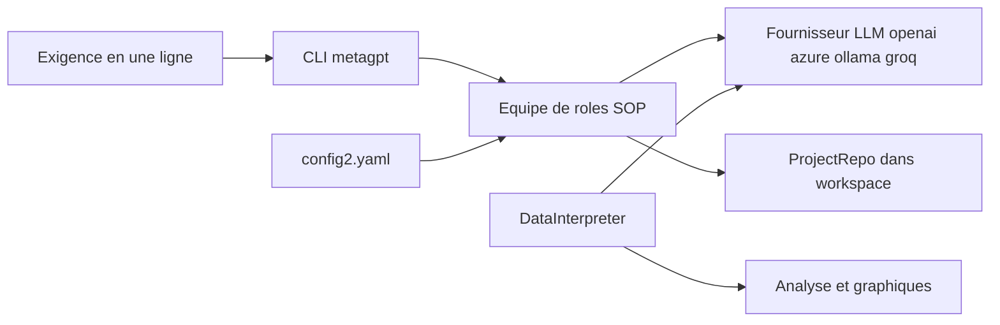

# geekan/MetaGPT

> **Un framework Python qui fait collaborer plusieurs rôles LLM sur une demande logicielle.**

## Le problème

Faire produire à un LLM autre chose qu'un fichier isolé demande de rejouer à la main la chaîne
« besoin → spécification → architecture → code ». Sans cadre, chaque relance repart de zéro et
rien ne relie la demande initiale aux artefacts produits.

## Ce que ça fait vraiment

MetaGPT prend une exigence en une ligne et produit, selon le README, des user stories, une
analyse concurrentielle, des exigences, des structures de données, des API et des documents.
En interne il instancie des rôles — product manager, architecte, chef de projet, ingénieur —
et leur applique des SOP orchestrées ; la philosophie affichée est `Code = SOP(Team)`.
La CLI `metagpt "Create a 2048 game"` écrit un dépôt dans `./workspace`. En bibliothèque,
`generate_repo()` renvoie un `ProjectRepo`. Un rôle à part, `DataInterpreter`, exécute du code
d'analyse de données (exemple README : jeu Iris de sklearn avec un graphique).
Le README ne documente pas les garanties de qualité du code généré.

## Comment c'est branché



Le point d'entrée est soit la CLI, soit `metagpt.software_company.generate_repo`. La
configuration vit dans `~/.metagpt/config2.yaml`, créé par `metagpt --init-config`, et
désigne le fournisseur LLM (`api_type`, `model`, `base_url`, `api_key`). La sortie est un
dépôt matérialisé, décrit côté Python par `metagpt.utils.project_repo.ProjectRepo`. Le
`DataInterpreter` (`metagpt.roles.di.data_interpreter`) est un chemin d'usage distinct,
asynchrone, qui écrit et exécute du code plutôt que de produire un dépôt.

## Essayer

```bash
python --version   # 3.9 ou plus, mais strictement < 3.12
conda create -n metagpt python=3.9 && conda activate metagpt
pip install --upgrade metagpt
metagpt --init-config   # crée ~/.metagpt/config2.yaml
metagpt "Create a 2048 game"  # this will create a repo in ./workspace
```

Le README demande aussi d'installer node et pnpm avant tout usage réel. Une démo sans
installation existe sur le Space Hugging Face `deepwisdom/MetaGPT-SoftwareCompany`.

## Coût et pièges

Python 3.9 à 3.11 seulement : la borne haute exclut 3.12. Node et pnpm sont exigés en plus du
paquet pip. Il faut une clé d'API de fournisseur LLM, à ta charge : l'exemple de configuration
pointe `gpt-4-turbo` chez OpenAI, et la facturation dépend du nombre de rôles et de tours,
que le README ne chiffre pas. D'autres `api_type` sont cités (azure, ollama, groq), donc un
modèle local est possible, mais le README ne documente ni la qualité obtenue ni la
consommation dans ce cas. L'éditeur pousse par ailleurs un produit commercial séparé, MGX
(mgx.dev), ce qui est à garder en tête sur la trajectoire du projet open source.

## Ce que ce n'est pas

Ce n'est pas un générateur d'application fiable clé en main : rien dans le README ne promet
que le dépôt produit compile, passe des tests ou soit maintenable. Ce n'est pas non plus un
modèle ni un fournisseur d'inférence — il faut apporter son propre LLM. Enfin ce n'est pas
MGX : le produit hébergé annoncé en 2025 est distinct du paquet installé ici.

## Alternatives

Aucun concurrent n'est nommé dans le README ; les rapprochements viennent des voisins du
catalogue. `Significant-Gravitas/AutoGPT` vise l'agent autonome généraliste là où MetaGPT
impose des rôles et des SOP d'entreprise logicielle. `langchain-ai/langchain` est une boîte à
outils plus bas niveau : à préférer si tu veux câbler toi-même le graphe d'agents.
`langflow-ai/langflow` propose le montage visuel de ces chaînes plutôt qu'une équipe préfaite.

## Pour toi

Intéressant surtout pour le `DataInterpreter`, qui est un agent d'analyse de données
exécutable en quelques lignes, et comme référence d'implémentation d'orchestration
multi-agents par SOP. Pour de la génération de dépôt en production, à surveiller plutôt qu'à
adopter : la licence n'est pas déclarée dans le catalogue (le README affiche un badge MIT) et
le centre de gravité de l'éditeur s'est déplacé vers son offre hébergée.
