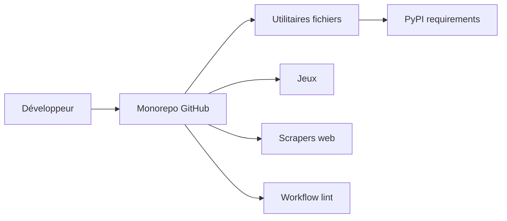

# geekcomputers/Python

> Collection de petits scripts Python d'automatisation et d'apprentissage, pour débutants.

## Le problème
Un débutant cherche des exemples concrets de petits programmes (fichiers, réseau, jeux) à lire et à modifier.

## Ce que ça fait vraiment
Un monorepo de scripts autonomes, sans service commun : renommage de fichiers, taille de dossiers, ping de serveurs, jeux (blackjack, space invader), téléchargements, scrapers (actualités, cricket), analyseur de discussions WhatsApp, entre autres. Chaque dossier a parfois son README et son `requirements.txt`. Deux workflows CI : lint et supervision synthétique Datadog.

## Comment c'est branché


## Essayer
```bash
# Aucune commande d'installation globale dans le README.
# Exemple cité pour un script :
# smart_file_organizer.py --path ... --interval ...
```

## Coût et pièges
Gratuit. Qualité inégale : l'auteur dit ne pas se considérer comme programmeur. Certains scripts (WhatsApp, tweeter, YouTube) dépendent de services tiers qui évoluent. 504 issues ouvertes.

## Ce que ce n'est pas
Ce n'est pas une bibliothèque installable ni un projet cohérent : les scripts sont indépendants, sans tests systématiques.

## Alternatives
Aucune alternative nommée dans le README.

## Pour toi
À ignorer : trop hétérogène pour un profil data/IA/MLOps ; mieux vaut une référence ciblée comme un aide-mémoire Python.

