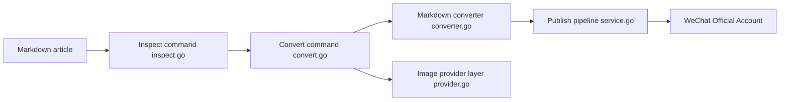

# geekjourneyx/md2wechat-skill

> CLI pour agents qui convertit du Markdown en articles WeChat Official Account et les envoie en brouillon.

## Le problème
Mettre en forme et publier un article sur un compte WeChat (HTML spécifique, images, cover, brouillon) est manuel.

## Ce que ça fait vraiment
Commandes `inspect`, `preview`, `convert` (avec upload d'images et création de brouillon à la demande), `write`, `humanize`, `title suggest`, génération de cover et d'infographie, plus des commandes de découverte JSON pour Claude Code, Codex et autres. La v3.6.0 prépare des brouillons Zhihu, CSDN, Toutiao via un navigateur déjà connecté. Le rendu final complet exige un mode API payant.

## Comment c'est branché


## Essayer
```bash
npm install -g @geekjourneyx/md2wechat
md2wechat version --json
md2wechat config init --json
md2wechat inspect article.md --json
md2wechat convert article.md --output article.html
```

## Coût et pièges
Le mode API (48 thèmes, modules `:::`) coûte 199 ¥ à vie ; le mode gratuit produit un prompt à faire finir par un LLM externe. Fournisseurs d'images à clé propre. Compte WeChat et liste blanche d'IP.

## Ce que ce n'est pas
Pas open source au sens usuel : « Source Available », usage commercial, SaaS, redistribution et données d'entraînement soumis à licence commerciale. README en chinois.

## Alternatives
Aucune alternative nommée dans le README.

## Pour toi
À ignorer : très spécifique à WeChat, mode complet payant et licence restrictive, sans lien avec un profil data/IA.

