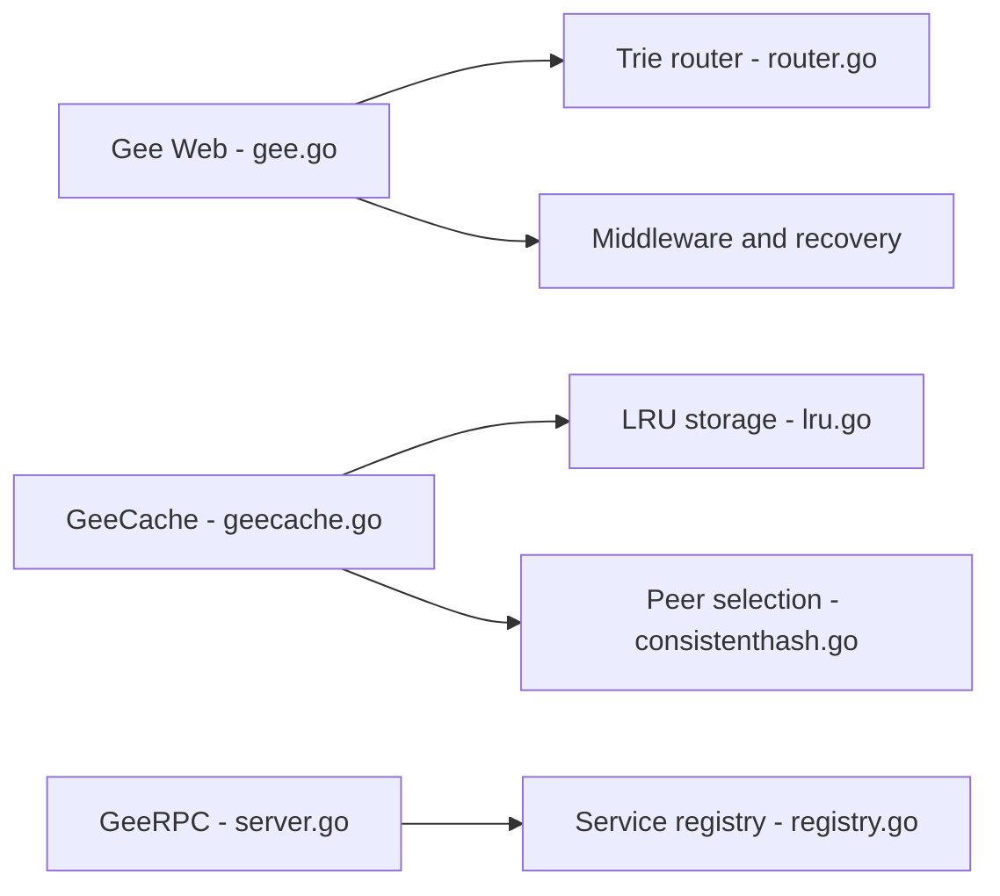

# geektutu/7days-golang

> Série de tutoriels Go qui réimplémente en sept jours un framework web, un cache, un ORM et un RPC.

## Le problème
Comprendre comment fonctionnent un framework web, un cache distribué, un ORM ou un RPC en les construisant soi-même.

## Ce que ça fait vraiment
Quatre mini-projets pas à pas : Gee (type gin : routeur en trie, contexte, groupes, middlewares, récupération de panic), GeeCache (type groupcache : LRU, hachage cohérent, singleflight, Protobuf), GeeORM (type xorm : mapping, hooks, transactions, migrations), GeeRPC (sur `net/rpc` : codec, timeout, équilibrage, registre). Démos WebAssembly. Texte principal en chinois et en anglais.

## Comment c'est branché

## Essayer
Aucune commande documentée dans le README ; chaque jour renvoie vers son code.

## Coût et pièges
Gratuit. Contenu pédagogique, non destiné à la production.

## Ce que ce n'est pas
Pas une bibliothèque réutilisable : ce sont des implémentations didactiques, très réduites.

## Alternatives
Aucune alternative nommée dans le README (gin, groupcache, gorm et xorm sont les modèles imités).

## Pour toi
À ignorer : excellent pour apprendre le Go système, mais hors des besoins d'un profil data/IA/MLOps.

