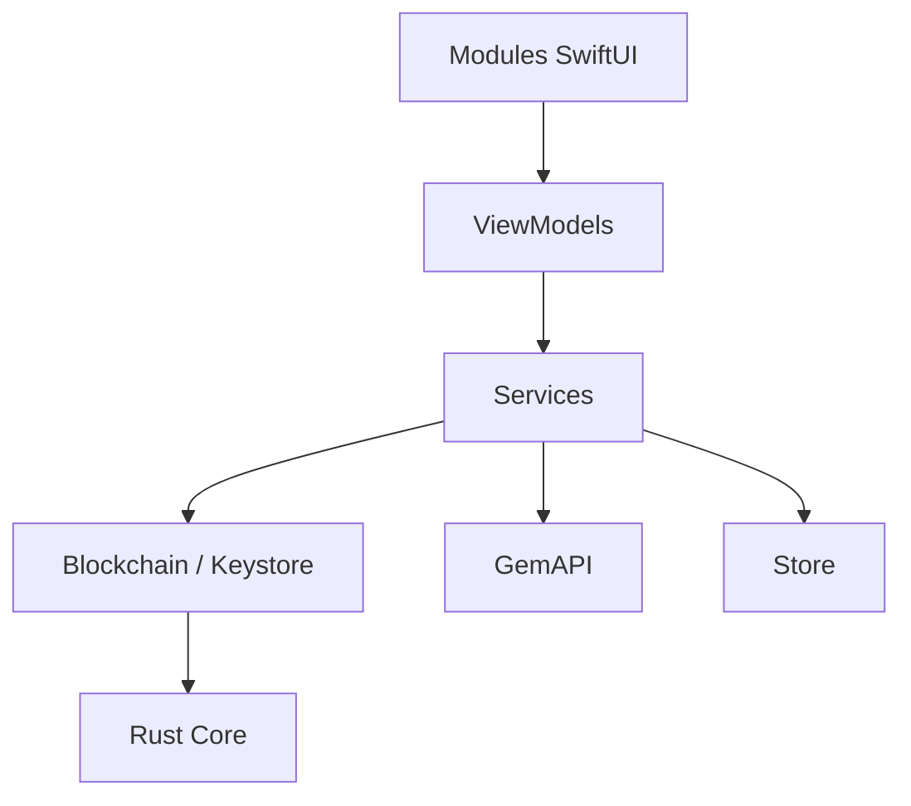

# gemwalletcom/gem-ios

> Application iOS de portefeuille crypto en SwiftUI, avec un cœur Rust, pour la garde de ses propres fonds.

## Le problème
Détenir et échanger des cryptomonnaies sur plusieurs chaînes sans confier ses clés à un tiers.

## Ce que ça fait vraiment
App SwiftUI modulaire (Onboarding, WalletTab, Swap, Staking, PriceAlerts, NFT, QRScanner), MVVM, services (assets, balances, prix, chaînes), paquets Blockchain, Keystore, Primitives, Store. Le cœur cryptographique est la bibliothèque Rust `core` (Gemstone), en sous-module. Communique avec `GemAPI` et WalletConnect.

## Comment c'est branché


## Essayer
```bash
git clone https://github.com/gemwalletcom/gem-ios.git --recursive
brew install just
just bootstrap
```

## Coût et pièges
Gratuit ; il faut Xcode et un Mac Apple silicon par défaut. Dépôt archivé : le développement a probablement continué ailleurs, non précisé.

## Ce que ce n'est pas
Pas une bibliothèque réutilisable. Licence GPL-3.0 : toute dérivée doit rester ouverte. Aucun audit de sécurité n'est cité dans le README.

## Alternatives
Aucune nommée dans le README.

## Pour toi
Ignorer : portefeuille crypto mobile archivé, sans usage dans un travail data, IA ou MLOps.

