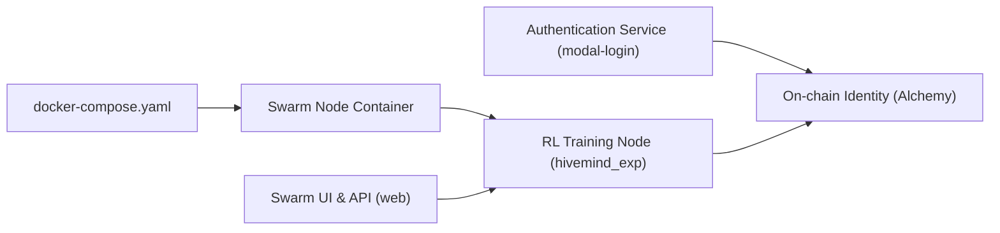

# gensyn-ai/rl-swarm

> Système pair à pair d'apprentissage par renforcement collaboratif, relié au testnet Gensyn.

## Le problème
Entraîner des modèles par RL en collectif, sans serveur central, avec une identité de participant vérifiable.

## Ce que ça fait vraiment
Chaque nœud entraîne localement un petit modèle (rôle Solver sur des tâches de code avec Qwen2.5-Coder-0.5B, via GRPO) et partage ses rollouts avec ses pairs par réseau DHT/gossip (Hivemind, GenRL). Login via Alchemy, identité on-chain liée à `swarm.pem`, tableau de bord de testnet. Le README dit qu'aucun swarm officiel n'est actif pour l'instant.

## Comment c'est branché


## Essayer
```bash
git clone https://github.com/gensyn-ai/rl-swarm
docker compose run --rm --build -Pit swarm-gpu
python3 -m venv .venv
source .venv/bin/activate
./run_rl_swarm.sh
```

## Coût et pièges
32 Go de RAM minimum en CPU, ou GPU CUDA (3090 à H100). Compte email et jeton HuggingFace en option. La perte de `swarm.pem` casse le lien avec l'identité. Dernier push en janvier 2026.

## Ce que ce n'est pas
Pas un outil d'entraînement général : il sert un réseau expérimental à points de participation, sans swarm officiel actif actuellement.

## Alternatives
Aucune alternative nommée dans le README.

## Pour toi
À ignorer : logiciel expérimental attaché à un testnet inactif, avec identité on-chain, sans usage utile pour un pipeline MLOps.
