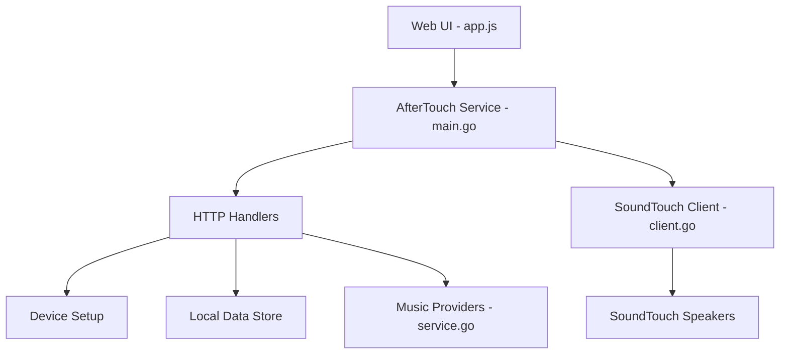

# gesellix/Bose-SoundTouch

> Serveur local qui remplace le cloud Bose arrêté, pour continuer à piloter ses enceintes SoundTouch.

## Le problème
Bose a coupé son cloud SoundTouch le 6 mai 2026 : presets, navigation des services musicaux et appairage stéréo ne fonctionnent plus via l'infrastructure Bose.

## Ce que ça fait vraiment
AfterTouch est un serveur local (interface web sur `localhost:8000`) qui émule le cloud Bose une fois l'enceinte redirigée vers lui (redirection XML ou DNS/DHCP avec CA maison). Le dépôt fournit aussi `soundtouch-backup` (sauvegarde du compte et des enceintes), `soundtouch-cli`, `soundtouch-player` (UI web LAN) et une bibliothèque Go `pkg/client`. L'accès SSH aux enceintes passe par une clé USB `remote_services`.

## Comment c'est branché


## Essayer
```bash
go get github.com/gesellix/bose-soundtouch
soundtouch-backup all
```
Le service lui-même s'obtient depuis la page Downloads, puis l'UI web guide la configuration.

## Coût et pièges
Gratuit. Il faut une adresse stable sur le réseau local ; la redirection DNS exige le port 53 et TLS (faire confiance à la CA sur chaque enceinte). Le chemin SSH et la méthode hosts sont délicats ; une méthode hosts est dépréciée.

## Ce que ce n'est pas
Pas un produit Bose ni affilié à Bose (le README le dit). Ce n'est pas un outil data/IA : il ne sert qu'à qui possède des enceintes SoundTouch. Le dépôt ne redistribue pas le code Bose Stockholm.

## Alternatives
- SoundCork : service Python d'interception, à l'origine de l'approche.
- SoundTouch Plus : intégration Home Assistant.
- STR, SoundTouch Reborn : agent sur l'enceinte plus app desktop.

## Pour toi
Hors périmètre data/IA/MLOps : à surveiller seulement si tu as des enceintes Bose SoundTouch à sauver, sinon aucun intérêt pour ton profil.

