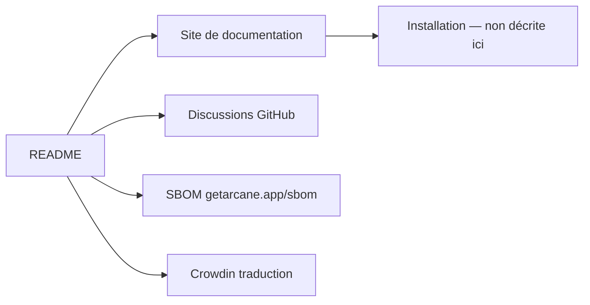

# getarcaneapp/arcane

> Interface de gestion Docker ; le README ne décrit ni les fonctions, ni l'installation.

## Le problème
Non documenté dans le README. Le nom du projet de traduction Crowdin,
« arcane-docker-management », est le seul indice sur l'objet de l'outil.

## Ce que ça fait vraiment
Fiche minimale : le README ne contient que quatre renvois — les demandes de fonctionnalités
déplacées vers les Discussions, le site de documentation officiel pour l'installation et la
configuration, une nomenclature logicielle (SBOM) publiée sur getarcane.app/sbom, et un appel à
traduction sur Crowdin. Aucune description de fonctionnalité, aucune capture, aucune architecture.

## Comment c'est branché


## Essayer
```bash
# Aucune commande documentée dans le README : tout renvoie au site de documentation.
```

## Coût et pièges
Non documenté. Ni licence, ni prérequis, ni modèle économique dans le README. La publication
d'un SBOM est un bon signe de transparence sur les dépendances, mais ne compense pas l'absence
de description.

## Ce que ce n'est pas
Impossible de le dire avec ce README : il ne permet pas de savoir ce que fait l'outil, ni s'il
gère des conteneurs locaux, distants, ou des stacks. Ce n'est pas évaluable en l'état.

## Alternatives
Aucune alternative nommée dans le README.

## Pour toi
Rien à en tirer sans aller sur le site : à ignorer tant que le README ne dit pas ce que c'est.
