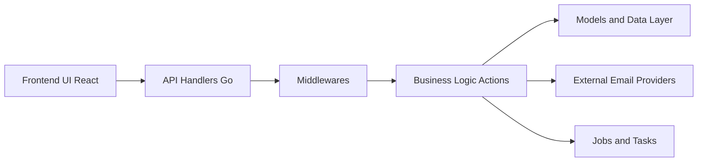

# getfider/fider

> Portail de feedback où les clients proposent et votent des fonctionnalités.

## Le problème
Centraliser les demandes de fonctionnalités des utilisateurs plutôt que de les perdre dans des mails et des chats.

## Ce que ça fait vraiment
Application Go avec frontend React : les handlers API passent par des middlewares et des actions métier, s'appuient sur une base SQL (PostgreSQL d'après les migrations) et des services d'e-mail (SES, Mailgun, SMTP), de facturation (Paddle) et de stockage. Des jobs asynchrones traitent notifications et purges.

## Comment c'est branché

## Essayer
Aucune commande documentée dans le README (renvoi à la documentation pour l'auto-hébergement).

## Coût et pièges
Deux voies : Fider Cloud, service géré et payant, ou auto-hébergement gratuit à ta charge. Base SQL et service d'e-mail à prévoir.

## Ce que ce n'est pas
Ce n'est pas un outil de support ou de ticketing : c'est un tableau de suggestions publiques.

## Alternatives
Aucune alternative nommée dans le README.

## Pour toi
À ignorer : outil produit/support, sans lien avec le travail data/IA.

