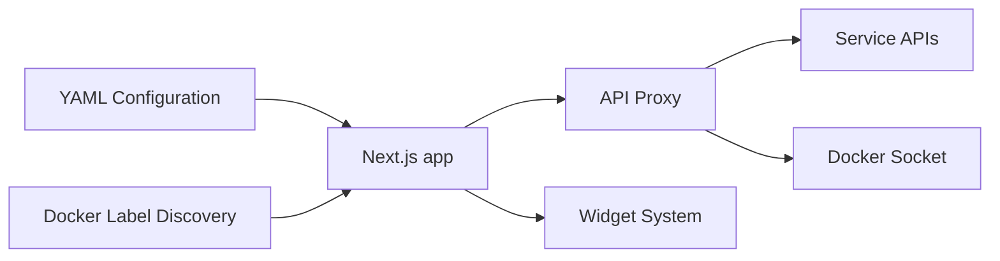

# gethomepage/homepage

> Tableau de bord statique configurable en YAML pour services auto-hébergés.

## Le problème
Avec beaucoup de services auto-hébergés, on perd la vue d'ensemble et les clés d'API finissent exposées côté navigateur.

## Ce que ça fait vraiment
Appli Next.js générée statiquement ; requêtes vers les services proxifiées côté serveur pour cacher les clés.
100+ intégrations (*arr, Plex, Jellyfin, qBittorrent…), widgets météo/heure/recherche/glances.
Découverte automatique via labels Docker ; configuration YAML ; 40+ langues.
Connexion OIDC ou mot de passe optionnelle.

## Comment c'est branché
Diagramme non fourni (aucun composant lisible). D'après l'architecture décrite :


## Essayer
```bash
docker run --name homepage \
  -e HOMEPAGE_ALLOWED_HOSTS=gethomepage.dev \
  -p 3000:3000 \
  -v /path/to/config:/app/config \
  ghcr.io/gethomepage/homepage:latest
pnpm install
pnpm dev
```

## Coût et pièges
Doit être derrière un reverse proxy authentifié s'il est exposé ; le montage du socket Docker donne des droits étendus.

## Ce que ce n'est pas
Pas un outil de supervision ni d'alerte. Pas pertinent pour le travail data/IA.

## Alternatives
Aucune alternative nommée dans le README.

## Pour toi
Un tableau de bord pour services auto-hébergés : pratique pour ton homelab, mais sans rôle dans une chaîne data ou MLOps.
