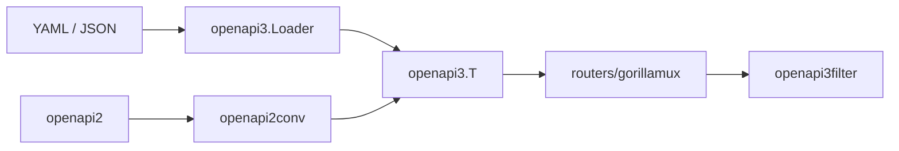

# getkin/kin-openapi

> Bibliothèque Go pour charger, valider et router des documents OpenAPI 2 et 3.

## Le problème
Manipuler et vérifier des spécifications OpenAPI, puis valider requêtes et réponses HTTP contre elles, demande beaucoup de code sur mesure.

## Ce que ça fait vraiment
`openapi3.Loader` charge et résout les `$ref`. Les paquets `openapi2`, `openapi2conv` (v2 vers v3), `openapi3`, `openapi3filter` (validation HTTP), `routers` (gorillamux) et `openapi3gen` (schémas depuis des types Go) couvrent le reste. Les erreurs ont un code stable, et l'origine (fichier, ligne) peut être suivie. Le support 3.2 est partiel.

## Comment c'est branché


## Essayer
```bash
go run github.com/getkin/kin-openapi/cmd/validate@latest [--defaults] [--examples] [--ext] [--patterns] -- <local YAML or JSON file>
```

## Coût et pièges
Gratuit. Les changements cassants sont fréquents : le journal du README liste des dizaines de versions avec ruptures d'API.

## Ce que ce n'est pas
Pas un générateur de serveur. Pas de support complet d'OpenAPI 3.2.

## Alternatives
- libopenapi : parseur et boîte à outils complet pour OpenAPI 3.1, 3.0 et Swagger.

## Pour toi
À surveiller si tu valides des contrats d'API en Go : solide, mais prévoir de la maintenance à chaque montée de version.

