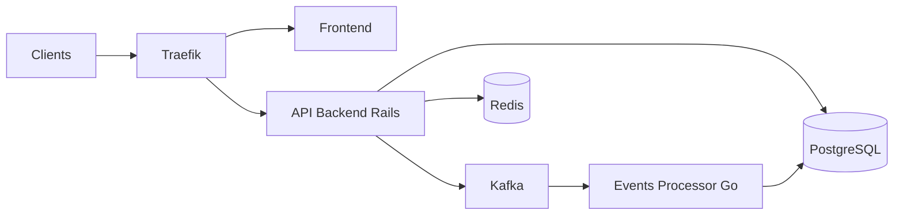

# getlago/lago

> Plateforme open source de facturation à l'usage (métrage, tarification, factures), orientée produits IA.

## Le problème
Facturer des tokens, du calcul GPU ou des appels API impose un métrage fiable, des grilles tarifaires changeantes et des factures, sans réécrire la facturation à chaque offre.

## Ce que ça fait vraiment
Ingère des événements d'usage idempotents (`transaction_id`), les agrège en métriques facturables.
Tarification à l'usage, paliers, crédits prépayés, abonnements, droits d'accès ; factures, taxes, relances.
API REST/OpenAPI, SDK (Node, Python, Ruby, Go), CLI, serveur MCP, SDK agents pour instrumenter les appels LLM.
Backend Rails + processeur d'événements Go, PostgreSQL, Redis ; paiements via Stripe, Adyen, GoCardless.

## Comment c'est branché


## Essayer
```bash
./examples/agentic-ai-demo/run.sh
./examples/agentic-ai-demo/run.sh --cleanup
git clone --depth 1 https://github.com/getlago/lago.git
cd lago
echo "LAGO_RSA_PRIVATE_KEY=\"$(openssl genrsa 2048 | openssl base64 -A)\"" >> .env
docker compose up -d
```

## Coût et pièges
Open source AGPLv3 ; Lago Cloud et fonctions Premium payantes. Analytics produit activées par défaut en auto-hébergé (opt-out possible).

## Ce que ce n'est pas
Pas un processeur de paiement : il orchestre Stripe/Adyen. Certains assistants (Billing Assistant) sont Premium ou en bêta.

## Alternatives
Aucune nommée dans le README.

## Pour toi
À surveiller : pertinent si tu dois monétiser une API de modèle au token, avec une démo locale qui montre le calcul ; sinon hors périmètre.
