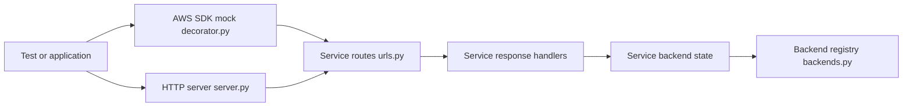

# getmoto/moto

> Bibliothèque Python qui simule les services AWS en mémoire pour tester du code boto3.

## Le problème
Tester du code qui appelle S3, DynamoDB ou autre service AWS oblige soit à toucher un vrai compte (lent, coûteux), soit à écrire des mocks fragiles.

## Ce que ça fait vraiment
Le décorateur `@mock_aws` intercepte les appels boto3 et les sert depuis un compte AWS virtuel qui garde l'état (buckets, clés…). Un mode serveur HTTP accepte aussi des requêtes au format AWS. Couverture large des services, détaillée dans la page de couverture ; les Step Functions ont même un évaluateur de workflow et un historique d'événements.

## Comment c'est branché


## Essayer
```bash
pip install 'moto[ec2,s3,all]'
```

## Coût et pièges
Gratuit, financé via OpenCollective. Les extras (`[s3]`, `[all]`) conditionnent les services disponibles.

## Ce que ce n'est pas
Pas un émulateur complet d'AWS : la couverture varie selon les services et les fonctionnalités. Ne remplace pas un test d'intégration contre le vrai cloud.

## Alternatives
Aucune alternative nommée dans le README.

## Pour toi
À adopter pour tester des pipelines qui lisent ou écrivent sur S3/DynamoDB : un décorateur suffit, les tests deviennent rapides et gratuits, et le projet est maintenu depuis 2013.
