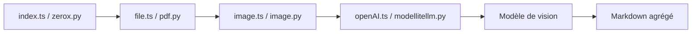

# getomni-ai/zerox

> SDK Node et Python qui convertit des documents en Markdown en les faisant lire page par page par un modèle de vision.

## Le problème
Les PDF avec tableaux, graphiques et mises en page complexes passent mal dans un OCR classique avant ingestion par un LLM.

## Ce que ça fait vraiment
Convertit le fichier en images, envoie chaque page à un modèle de vision, agrège le Markdown. Option `maintainFormat` : la page précédente sert de contexte (plus lent). Le SDK Node ajoute extraction structurée par schéma, correction d'orientation et rognage ; le SDK Python passe par LiteLLM.

## Comment c'est branché


## Essayer
```bash
npm install zerox
pip install py-zerox
```
```ts
const result = await zerox({ filePath: "path/to/file", credentials: { apiKey: process.env.OPENAI_API_KEY } });
```

## Coût et pièges
Une requête de vision par page : facture à ta charge. Dépendances système : graphicsmagick (Node), poppler (Python). Dernier push mai 2025.

## Ce que ce n'est pas
Les deux SDK n'ont pas les mêmes fonctions (extraction de données et erreurs réglables côté Node seulement). La qualité n'est pas mesurée dans le README.

## Alternatives
Aucune alternative nommée dans le README.

## Pour toi
À surveiller : approche simple pour documents complexes, mais coût linéaire par page et activité en baisse depuis mai 2025 ; chiffre-le sur un document avant tout lot.

