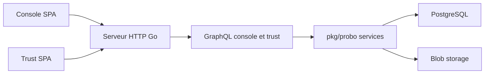

# getprobo/probo

> Plateforme GRC auto-hébergeable pour équipes techniques, pilotable par web, CLI, GraphQL et agents MCP.

## Le problème
Suivre risques, contrôles, fournisseurs et audits dans des tableurs ne s'automatise pas et ne laisse pas de trace exploitable.

## Ce que ça fait vraiment
Une console web, une CLI `prb`, une API GraphQL et plus de 270 outils MCP sur : registre de risques, contrôles et référentiels, risque fournisseurs, vie privée (DPIA), revues d'accès, audits, preuves, documents signés, page de conformité publique. D'après le code : un binaire Go `probod`, deux SPA React (console et trust), PostgreSQL, stockage S3 ou local.

## Comment c'est branché


## Essayer
```bash
git clone --recurse-submodules https://github.com/getprobo/probo.git
cd probo
go mod download
npm ci
make stack-up
make build
make dev-config
bin/probod -cfg-file cfg/dev.yaml
```

## Coût et pièges
Go 1.27+, Node 24.15+, npm 12.0.2+, Docker et mkcert. Version de développement : la mise en production passe par CONTRIBUTING.md. Les outils MCP donnent à un agent LLM un accès en écriture sur les données de conformité.

## Ce que ce n'est pas
Pas un outil de sécurité ni un scanner : il organise le suivi de conformité. Ne remplace pas un auditeur.

## Alternatives
Aucune alternative nommée dans le README.

## Pour toi
Surveiller : intéressant si tu dois documenter la conformité de plateformes IA (DPIA, fournisseurs) et l'automatiser par MCP, mais périmètre GRC hors du cœur data.

