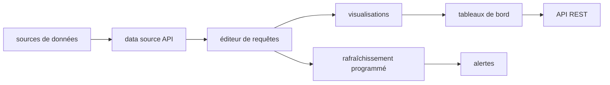

# getredash/redash

> Interface web pour écrire des requêtes, les visualiser et partager des tableaux de bord.

## Le problème
Les requêtes SQL utiles dorment dans les fichiers locaux de chacun, sans revue ni partage.
Les non-techniques dépendent d'un analyste pour chaque chiffre à rafraîchir.

## Ce que ça fait vraiment
Éditeur de requêtes SQL et NoSQL avec navigateur de schéma et autocomplétion, tout dans le navigateur.
Visualisations construites par glisser-déposer, assemblées en tableaux de bord partageables par URL.
Rafraîchissement programmé à intervalle choisi ; alertes déclenchées sur condition quand la donnée change.
API REST couvrant tout ce que fait l'interface ; API de source de données extensible avec support natif d'une longue liste de bases.

## Comment c'est branché

## Essayer
Aucune commande d'installation n'est écrite dans le README : il renvoie vers la page « Setting up a Redash instance », qui inclut des images AWS/GCE prêtes à l'emploi.

## Coût et pièges
Rien à payer pour le logiciel, mais c'est une instance à héberger, sauvegarder et mettre à jour.
Les rafraîchissements programmés interrogent réellement tes bases : le coût se déplace côté entrepôt de données.

## Ce que ce n'est pas
Ce n'est pas un outil de modélisation ni de transformation : il lit, il ne construit pas les tables.
Ce n'est pas un BI complet : pas de couche sémantique ni de métriques partagées décrites ici.
Le README ne mentionne ni licence, ni prérequis système, ni offre gérée.

## Alternatives
Aucune alternative nommée dans le README.

## Pour toi
Utile comme guichet SQL partagé pour une équipe non technique ; dispensable si tout le monde vit dans les notebooks.
