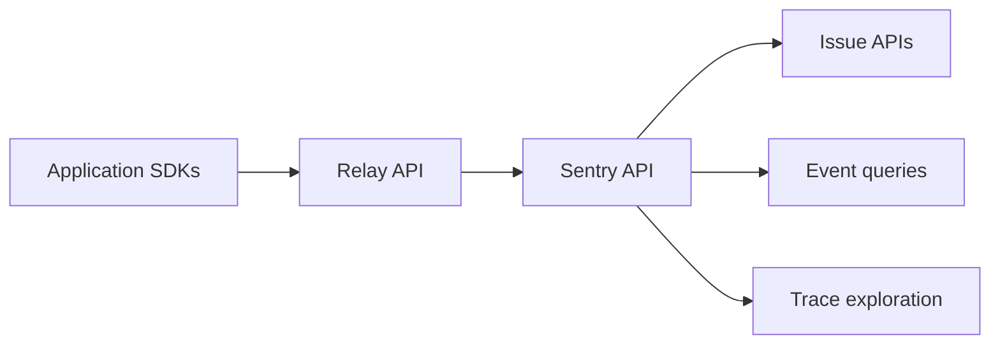

# getsentry/sentry

> Plateforme de débogage qui capte erreurs, traces et rejeux envoyés par les SDK applicatifs.

## Le problème
Détecter, tracer et corriger les erreurs d'une application en production.

## Ce que ça fait vraiment
Le README est quasi vide : slogan, liste des SDK officiels (JavaScript, Python, Go, Rust, Java, Swift, Unity…) et liens. Le graphe de code, partiel, montre des API pour issues, événements, traces, logs, profiling, rejeux et une indexation « Seer » d'aide IA. Le déploiement auto-hébergé n'est pas décrit ici.

## Comment c'est branché

## Essayer
Aucune commande documentée dans le README.

## Coût et pièges
Non documenté dans ce README. Aucune information fiable sur l'offre gratuite ou l'auto-hébergement.

## Ce que ce n'est pas
Pas un outil de monitoring d'infrastructure : il se focalise sur les erreurs applicatives. Cette fiche est minimale, faute de matière.

## Alternatives
Aucune alternative nommée dans le README.

## Pour toi
À surveiller : référence connue pour le suivi d'erreurs, mais la licence est non identifiée et le README ne permet pas de trancher davantage.

