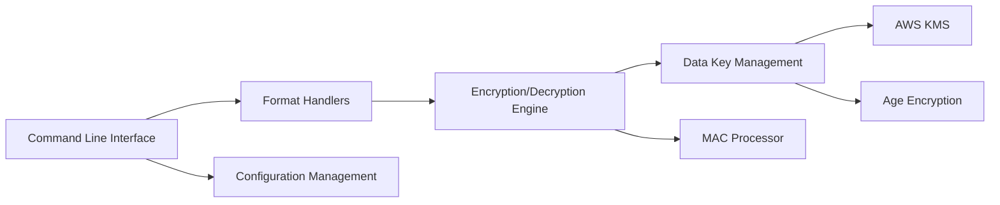

# getsops/sops

> Éditeur de fichiers chiffrés (YAML, JSON, ENV, INI) pour versionner des secrets sans les exposer.

## Le problème
Les secrets de configuration finissent en clair dans Git ou dans un coffre séparé qui dérive du code. Chiffrer à la main avec PGP est fastidieux et illisible en revue.

## Ce que ça fait vraiment
Chiffre les valeurs d'un fichier structuré en gardant les clés lisibles, donc les diffs restent exploitables.
Une clé de données AES256-GCM chiffre les valeurs ; elle est elle-même chiffrée par une ou plusieurs clés maîtres : AWS KMS, GCP KMS, Azure Key Vault, HuaweiCloud KMS, age, PGP.
Un MAC protège l'intégrité ; `.sops.yaml` fixe les règles par chemin.
Projet né chez Mozilla, donné à la CNCF en 2023.

## Comment c'est branché

## Essayer
Aucune commande documentée dans le README : il renvoie à getsops.io.

## Coût et pièges
Gratuit ; une clé KMS cloud se facture chez le fournisseur, age ou PGP restent locaux. Perdre la clé maître, c'est perdre les secrets.

## Ce que ce n'est pas
Pas un gestionnaire de secrets en ligne avec rotation ou audit. MPL-2.0 : copyleft faible, au niveau fichier. Le README est très succinct.

## Alternatives
Le README cite ses inspirations (hiera-eyaml, credstash, sneaker, password store) sans les comparer.

## Pour toi
À adopter pour les configs de tes pipelines et déploiements : avec age, c'est une façon simple et auditée de garder clés d'API et credentials dans le dépôt.
