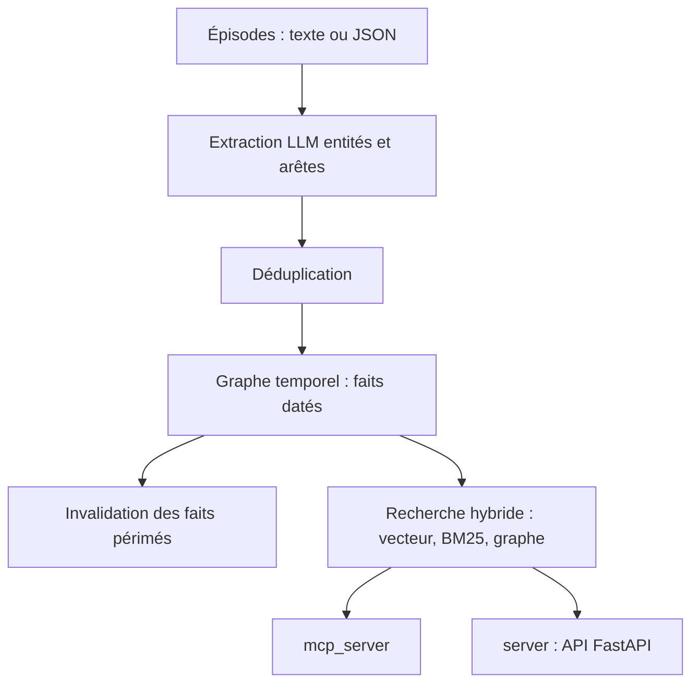

# getzep/graphiti

> Framework de graphes de contexte temporels pour agents : les faits ont une fenêtre de validité.

## Le problème
Un RAG classique traite par lots et résume statiquement : inefficace dès que les données changent souvent.
Quand un fait devient faux, rien ne dit ce qui était vrai avant, ni d'où le fait venait.

## Ce que ça fait vraiment
Construit un graphe d'entités, de relations et de faits où chaque fait porte une fenêtre de validité : quand il est devenu vrai, quand il a été remplacé. Les anciens faits sont invalidés, pas supprimés.
Tout remonte aux « épisodes », la donnée brute ingérée, ce qui donne la traçabilité complète du fait dérivé jusqu'à la source.
Ontologie prescrite (types d'entités et d'arêtes définis en modèles Pydantic) ou apprise, laissée émerger des données ; construction incrémentale sans recalcul par lots.
Récupération hybride combinant embeddings sémantiques, mots-clés BM25 et traversée de graphe ; backends Neo4j, FalkorDB, Amazon Neptune (Kuzu déprécié) ; serveur MCP et service REST FastAPI fournis.

## Comment c'est branché


## Essayer
```bash
pip install graphiti-core
uv add graphiti-core[falkordb]
docker run -p 6379:6379 -p 3000:3000 -it --rm falkordb/falkordb:latest
docker compose --profile falkordb up
```

## Coût et pièges
Clé OpenAI par défaut pour l'inférence et les embeddings ; chaque épisode ingéré coûte des appels LLM.
`SEMAPHORE_LIMIT` est volontairement bas (10) pour éviter les erreurs 429 : la lenteur constatée vient de là, à ajuster selon votre quota.

## Ce que ce n'est pas
Ce n'est pas une plateforme gérée : Zep, du même éditeur, l'est ; Graphiti est auto-hébergé, sans gestion d'utilisateurs, de threads ni de tableau de bord.
Ce n'est pas compatible avec n'importe quel modèle : le README prévient que les modèles sans sortie structurée fiable provoquent des échecs d'ingestion, surtout les petits.
La télémétrie anonyme est activée par défaut (PostHog), désactivable par `GRAPHITI_TELEMETRY_ENABLED=false`.

## Alternatives
- GraphRAG — comparé en détail : traitement par lots, résumé statique, pas de types d'entités personnalisés.
- Zep — l'offre managée du même éditeur, avec base de graphe propriétaire et SLA.

## Pour toi
Le bon choix si tu construis une mémoire d'agent qui doit savoir ce qui était vrai hier ; prévoir une base de graphe à opérer.
