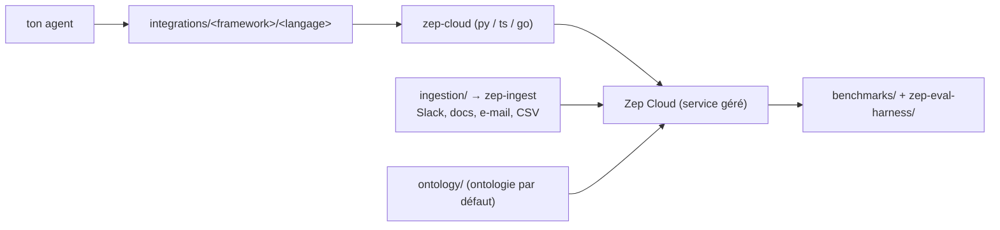

# getzep/zep

> Dépôt d'exemples, d'intégrations de frameworks et d'outils autour de la mémoire d'agents Zep Cloud.

## Le problème
Brancher une mémoire d'agent sur LangGraph, CrewAI ou le SDK Vercel demande à chaque fois du code de
liaison, et les exemples officiels sont dispersés entre langages.

## Ce que ça fait vraiment
Ce dépôt **n'est pas** le produit : il contient du code d'exemple, des paquets d'intégration et des
outils pour construire de la mémoire d'agent avec Zep Cloud. `examples/` regroupe applis et extraits
en Python, TypeScript et Go. `integrations/` contient des paquets organisés par framework puis par
langage, construits, testés et publiés indépendamment : Google ADK, Microsoft Agent Framework,
AutoGen, AG2, CrewAI, LangGraph, LiveKit, Pydantic AI, Strands Agents en Python ; Google ADK, Mastra,
Vercel AI SDK en TypeScript ; Google ADK en Go. `ingestion/` livre `zep-ingest`, un pipeline
d'ingestion en masse (Slack, documents, e-mail, JSON/CSV, triplets de faits). `benchmarks/` couvre
LoCoMo et LongMemEval, et `zep-eval-harness/` l'évaluation ingestion et récupération.

## Comment c'est branché


## Essayer
```bash
pip install zep-cloud
npm install @getzep/zep-cloud
go get github.com/getzep/zep-go/v3
```

## Coût et pièges
Zep Cloud est un service géré : inscription sur `getzep.com` et clé nécessaires, le tarif n'est pas
documenté ici. `legacy/` contient la Zep Community Edition, marquée dépréciée et **non supportée** :
ce n'est pas un chemin d'auto-hébergement.

## Ce que ce n'est pas
Pas le moteur de mémoire : le graphe de connaissances temporel qui fait tourner Zep est le projet
séparé Graphiti. Pas un dépôt à installer d'un bloc : chaque paquet d'intégration se publie de son
côté, et le README renvoie à `integrations/README.md` pour l'état de release réel.

## Alternatives
- Graphiti : le framework libre de graphe de connaissances temporel, sans le service géré.

## Pour toi
Le vrai dépôt à lire est Graphiti ; celui-ci sert à copier une intégration LangGraph vite fait.
