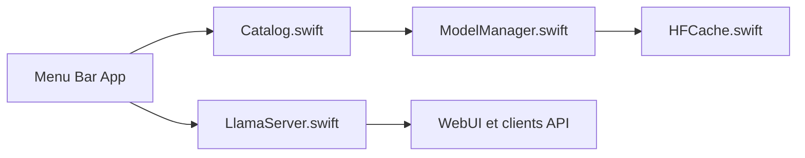

# ggml-org/LlamaBarn

> Application macOS de barre de menus qui sert des LLM locaux via llama.cpp sur une API compatible OpenAI.

## Le problème
Lancer llama.cpp, choisir des modèles GGUF et régler les paramètres adaptés à son Mac demande du travail manuel.

## Ce que ça fait vraiment
Démarre un serveur local sur `http://localhost:9931/v1`, utilise llama.cpp s'il est installé (sinon télécharge un binaire). Installe n'importe quel GGUF de Hugging Face dans le cache partagé, recommande des modèles adaptés au matériel, charge les modèles à la demande et les décharge à l'inactivité. WebUI intégrée. Réglages utilisateur dans `~/.config/llama/models.user.ini`.

## Comment c'est branché


## Essayer
```bash
brew install --cask llama-app
curl http://localhost:9931/v1/models
curl http://localhost:9931/v1/chat/completions -H "Content-Type: application/json" -d '{"model": "ggml-org/gpt-oss-20b-GGUF:MXFP4", "messages": [{"role": "user", "content": "Hello"}]}'
```

## Coût et pièges
Gratuit ; la taille des modèles pèse sur disque et mémoire. Le serveur n'a pas de mot de passe : l'option « This network » l'expose à tout le réseau, à éviter hors réseau de confiance (Tailscale proposé).

## Ce que ce n'est pas
Pas multiplateforme (macOS). Pas un moteur d'inférence : il s'appuie sur llama.cpp.

## Alternatives
Aucune alternative nommée dans le README.

## Pour toi
À adopter si tu as un Mac : maintenu par l'organisation ggml, MIT, bon moyen d'avoir une API locale compatible OpenAI sans configuration.

