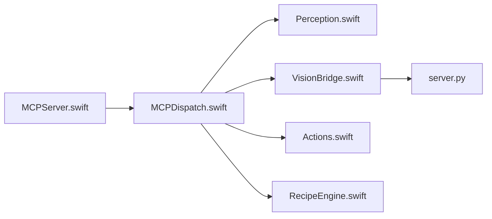

# ghostwright/ghost-os

> Serveur MCP qui laisse un agent IA voir et piloter les applications macOS via l'arbre d'accessibilité.

## Le problème
Un agent de code reste enfermé dans sa fenêtre de chat : il ne peut pas cliquer, remplir un formulaire ou envoyer un mail dans une vraie application.

## Ce que ça fait vraiment
Expose 29 outils MCP (lecture du contexte, clic, frappe, glisser, fenêtres, attente) fondés sur l'arbre d'accessibilité macOS, avec repli sur un modèle de vision local (ShowUI-2B) pour les apps web. Les workflows se sauvegardent en « recettes » JSON paramétrées, rejouables ; un mode d'apprentissage observe l'utilisateur via un CGEvent tap et en tire une recette. Environ 7 000 lignes de Swift plus un sidecar Python.

## Comment c'est branché


## Essayer
```bash
brew install ghostwright/ghost-os/ghost-os
ghost setup
ghost doctor
```

## Coût et pièges
macOS 14+ et Swift 6.2+ pour compiler. Permissions Accessibilité, Enregistrement d'écran et Surveillance de l'entrée requises. Le modèle de vision pèse environ 3 Go. Dernier push en mars 2026.

## Ce que ce n'est pas
Pas multiplateforme : Mac uniquement. Donner la main sur toutes les apps à un agent est un risque en soi ; le README ne détaille pas de garde-fous. Les chiffres de fiabilité (« 100 % ») sont des affirmations du README.

## Alternatives
- Anthropic Computer Use et OpenAI Operator : comparés dans le README (approche par captures d'écran).
- OpenClaw : pilote le DOM du navigateur seulement.

## Pour toi
À surveiller : idée solide (arbre d'accessibilité plutôt que pixels) pour automatiser du Mac, mais jeune, réservé à macOS et peu mis à jour depuis mars.

