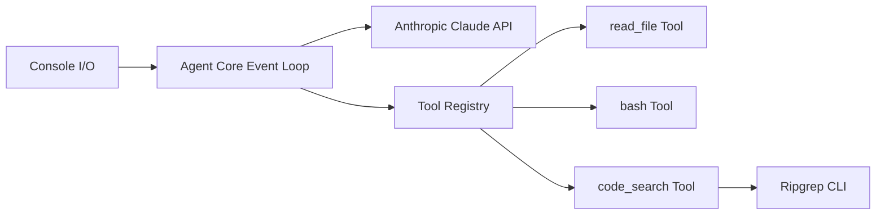

# ghuntley/how-to-build-a-coding-agent

> Atelier Go en six étapes pour construire un agent de code sur l'API Claude.

## Le problème
Les agents de code semblent magiques ; on comprend mal que ce n'est qu'une boucle LLM + outils.

## Ce que ça fait vraiment
Six programmes Go progressifs : chat, lecture de fichiers, listing, bash, édition, recherche ripgrep.
Tous partagent la même boucle : saisie → inférence → appel d'outil → résultat renvoyé → réponse.
Outils définis par nom, schéma JSON généré depuis une struct Go, et fonction.
Fichiers d'exemple fournis (`fizzbuzz.js`, `riddle.txt`).

## Comment c'est branché


## Essayer
```bash
go mod tidy
export ANTHROPIC_API_KEY="your-api-key-here"
go run chat.go
go run edit_tool.go
go run code_search_tool.go
```

## Coût et pièges
Clé Anthropic à ta charge ; Go 1.24.2+ ou devenv. L'outil bash exécute de vraies commandes sur ta machine.

## Ce que ce n'est pas
Pas un agent utilisable au quotidien : aucun garde-fou, pas de mémoire. Sans licence déclarée.

## Alternatives
Aucune alternative nommée dans le README.

## Pour toi
À adopter comme support d'apprentissage : une heure suffit pour démystifier les agents de code et en tirer un squelette pour tes propres outils.
