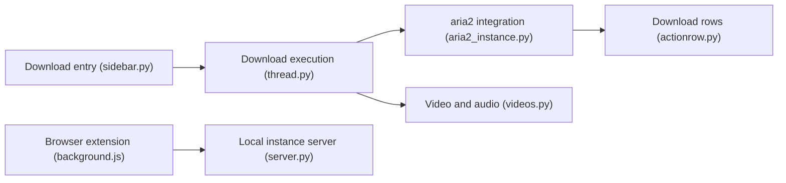

# giantpinkrobots/varia

> Gestionnaire de téléchargements GTK pour fichiers, torrents et vidéos, interface d'aria2 et yt-dlp.

## Le problème
Gérer dans une seule application des téléchargements directs, des torrents et des flux vidéo ou audio.

## Ce que ça fait vraiment
- Frontend de aria2 et yt-dlp, avec planificateur, notifications, icône de zone de notification.
- Sélection des fichiers d'un torrent, extension navigateur Firefox/Chrome.
- Linux (Flatpak en priorité), Windows ; macOS « expérimental ».
- Mises à jour automatiques sur l'installeur Windows.

## Comment c'est branché


## Essayer
```bash
flatpak install flathub io.github.giantpinkrobots.varia
sudo snap install varia
```

## Coût et pièges
Gratuit. La branche par défaut `next` peut ne pas compiler hors Flatpak. Paquets AUR et AppImage non officiels.

## Ce que ce n'est pas
Pas un outil de scraping ni de pipeline de données.

## Alternatives
Aucune alternative nommée dans le README.

## Pour toi
À ignorer : utilitaire de bureau ; pour de la collecte de données, tu appelleras directement aria2 ou yt-dlp.

