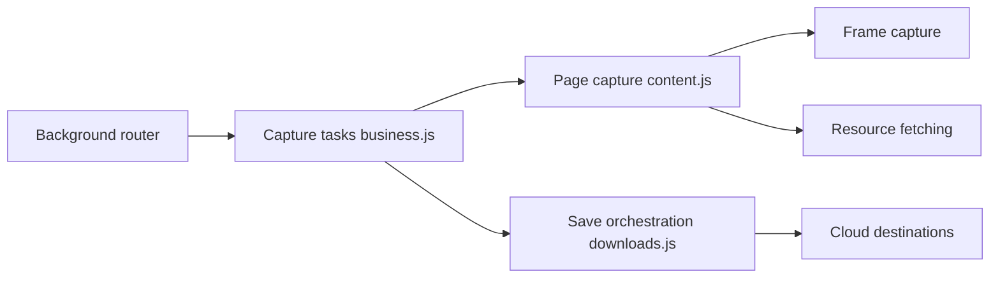

# gildas-lormeau/SingleFile

> Enregistre une page web complète dans un seul fichier HTML, via extension de navigateur ou CLI.

## Le problème
Sauvegarder une page avec ses images, styles et polices donne un dossier fragile ou un format peu portable.

## Ce que ça fait vraiment
Un clic capture la page (ou la sélection, des frames, plusieurs onglets) en HTML autonome minifié, ZIP auto-extractible ou MHTML. Annotation avant sauvegarde, sauvegarde automatique, envoi vers Google Drive ou GitHub, option de preuve d'existence par blockchain. Un CLI séparé existe (single-file-cli).

## Comment c'est branché


## Essayer
```bash
# Installation via les stores (Firefox, Chrome, Edge, Safari) ; aucune commande requise.
# Raccourci par défaut : Ctrl+Shift+Y pour sauvegarder l'onglet courant.
```

## Coût et pièges
Gratuit, licence AGPL-3.0 (copyleft fort si tu l'intègres dans un service). Mainteneur principal unique.

## Ce que ce n'est pas
Pas un crawler de site : une page à la fois (ou des onglets ouverts). Le CLI est dans un autre dépôt.

## Alternatives
ArchiveBox (archivage auto-hébergé), Karakeep, linkding, Linkwarden, Readeck : gestionnaires de signets qui s'appuient sur SingleFile.

## Pour toi
Excellent pour archiver articles et docs techniques de façon pérenne ; adopte-le comme extension personnelle, la licence ne gêne pas cet usage.

