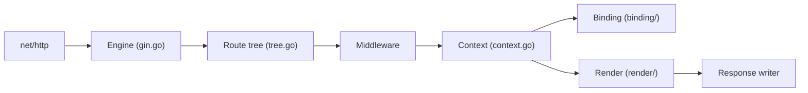

# gin-gonic/gin

> Framework web HTTP en Go, pour API REST et microservices, avec routage, middlewares, liaison et validation JSON.

## Le problème
La bibliothèque standard de Go demande du code répétitif pour le routage, les middlewares, la liaison des requêtes et le rendu des réponses.

## Ce que ça fait vraiment
Un moteur `gin.Default()` (avec journalisation et récupération sur panique), un routeur par arbre avec groupes de routes, un objet `Context` par requête, des middlewares en chaîne, une liaison des données (JSON, XML, YAML, formulaires, query, en-têtes) avec validation, et du rendu (JSON, XML, HTML, texte). Le codec JSON est interchangeable (stdlib, go-json, jsoniter, sonic).

## Comment c'est branché


## Essayer
```bash
go run main.go
```
Le `main.go` du README crée un routeur, expose `GET /ping` (réponse `{"message":"pong"}`) et démarre sur le port 8080.

## Coût et pièges
Gratuit. Le README annonce Go 1.26 ou plus. Les chiffres de benchmark du README viennent de leurs propres mesures (routage GitHub API) : à refaire sur ton cas.

## Ce que ce n'est pas
Ni un framework complet avec ORM ou authentification intégrés (ils passent par les middlewares gin-contrib) ni le plus rapide de son propre tableau de benchmark.

## Alternatives
- HttpRouter : le routeur dont Gin dérive, 21 360 ns/op contre 27 364 dans le tableau du README.
- Aero : 20 648 ns/op dans le même tableau, plus bas que Gin.

## Pour toi
À ignorer : framework Go, alors qu'un profil data/IA fait ses API en Python (FastAPI) ; il ne vaut que pour reprendre un service déjà écrit en Go.

