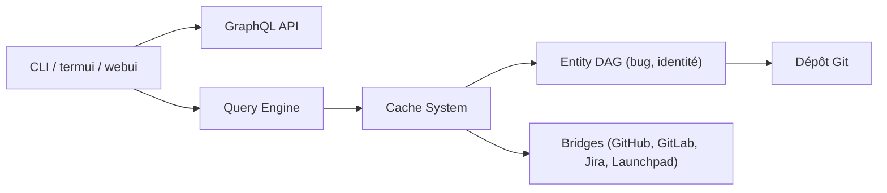

# git-bug/git-bug

> Suivi de tickets distribué, stocké dans Git, utilisable hors ligne en CLI, terminal ou web.

## Le problème
Les trackers de tickets sont des services externes : verrouillage, indisponibilité, pas d'accès hors ligne.

## Ce que ça fait vraiment
Les tickets sont stockés comme objets Git, sans ajouter de fichiers au projet. Tu les pousses et les tires (`git bug push`, `git bug pull`) avec les remotes. Interfaces : CLI, interface terminal (`termui`), interface web (`webui`, qui sert aussi de navigateur de code) via une API GraphQL. Des ponts importent et exportent vers GitHub, GitLab, Jira et Launchpad.

## Comment c'est branché


## Essayer
```bash
git bug user create
git bug add
git bug push [<remote>]
git bug pull [<remote>]
git bug ls "status:open sort:edit"
git bug webui
```

## Coût et pièges
Gratuit. L'interface web n'est pas prête comme portail public (WIP). L'installation est détaillée dans `INSTALLATION.md`, non reproduit ici.

## Ce que ce n'est pas
Pas un gestionnaire de projet complet ; pas un portail public d'issues pour l'instant. La GPL-3.0 impose le copyleft à toute redistribution modifiée.

## Alternatives
Aucune alternative nommée dans le README (il propose des ponts vers GitHub, GitLab, Jira et Launchpad).

## Pour toi
À surveiller : idée séduisante pour garder les tickets d'un dépôt de recherche hors ligne et dans Git, mais l'usage reste marginal et le pont vers les outils d'équipe demande du réglage.

