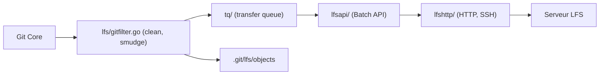

# git-lfs/git-lfs

> Extension Git en ligne de commande qui stocke les gros fichiers hors du dépôt et les remplace par des pointeurs.

## Le problème
Git gère mal les gros binaires (images, jeux de données, modèles) : le dépôt gonfle et les clones deviennent lents.

## Ce que ça fait vraiment
Des filtres Git (clean, smudge, filter-process) remplacent le gros fichier par un petit pointeur au commit et le restituent à l'extraction. Les objets sont mis en cache sous `.git/lfs/objects` et échangés avec un serveur LFS via une API de lots ; une file de transfert parallèle gère envois et téléchargements, avec verrouillage de fichiers. La commande `git lfs migrate` réécrit l'historique pour importer ou exporter.

## Comment c'est branché


## Essayer
```bash
git lfs install
git lfs track "*.psd"
git add .gitattributes
git commit -m "track *.psd files using Git LFS"
git lfs ls-files
git push origin main
git lfs migrate import --include="*.psd" --everything
```

## Coût et pièges
Gratuit côté client, mais il faut un serveur LFS (celui de l'hébergeur, souvent avec quota). `migrate` réécrit l'historique et change tous les identifiants d'objets. Licence non identifiée par GitHub : à vérifier. Ne pas importer le module Go comme dépendance : aucune API stable.

## Ce que ce n'est pas
Pas un outil de versionnement de données ou de modèles avec métadonnées ni un système de pipelines ; il ne fait que déporter les gros fichiers.

## Alternatives
Le README ne nomme aucune alternative.

## Pour toi
Adopter : la manière standard de versionner poids de modèles et gros jeux de données dans Git, tant que ton hébergeur propose du stockage LFS suffisant.

