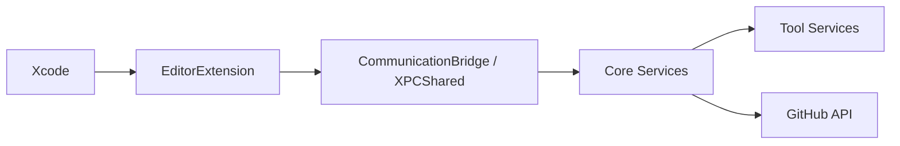

# github/CopilotForXcode

> Extension Xcode qui apporte complétion, chat et mode agent GitHub Copilot aux développeurs Swift.

## Le problème
Xcode n'a pas d'assistant de code IA natif équivalent aux éditeurs concurrents.

## Ce que ça fait vraiment
Application hôte plus extension d'éditeur Xcode, communiquant par XPC avec des services (Core, Tool) qui appellent les API GitHub Copilot. Apporte complétion (Tab pour accepter), chat, mode agent (édition de fichiers, commandes terminal, outils MCP). Exige macOS 13+, Xcode 14+ et un compte GitHub ; permissions Accessibilité et extension.

## Comment c'est branché


## Essayer
```bash
brew install --cask github-copilot-for-xcode
```

## Coût et pièges
Le service Copilot est un abonnement GitHub ; une facturation à l'usage arrive (v0.50.0+). Trois permissions macOS à accorder. Le README renvoie à une politique de confidentialité, sans détail de télémétrie.

## Ce que ce n'est pas
Le dépôt contient le client, pas les modèles ; inutile sans le service GitHub.

## Alternatives
Aucune nommée dans le README.

## Pour toi
À ignorer : utile seulement si tu développes en Swift sous Xcode, et dépend d'un abonnement.

