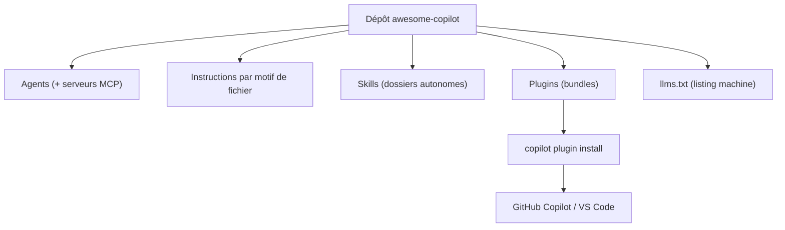

# github/awesome-copilot

> Collection communautaire d'agents, instructions, skills, hooks et plugins pour GitHub Copilot.

## Le problème
Les personnalisations de Copilot — instructions par motif de fichier, agents, skills — se
partagent sinon par capture d'écran et copier-coller entre équipes.

## Ce que ça fait vraiment
Range cinq familles de ressources : agents spécialisés qui s'intègrent à des serveurs MCP,
instructions appliquées automatiquement selon un motif de fichier, skills sous forme de dossiers
autonomes avec leurs ressources, plugins groupant agents et skills pour un workflow, et un
cookbook de recettes prêtes à coller pour les API Copilot.
La place de marché **Awesome Copilot** est déjà enregistrée dans le CLI et VS Code, l'installation
d'un plugin tient en une commande. Un fichier `llms.txt` lisible par machine liste agents,
instructions et skills. Un Learning Hub sur le site couvre hooks, workflows agentiques et
serveurs MCP.

## Comment c'est branché


## Essayer
```bash
copilot plugin install <plugin-name>@awesome-copilot
copilot plugin marketplace add github/awesome-copilot
```

## Coût et pièges
Le dépôt est gratuit ; il suppose un abonnement GitHub Copilot, donc une dépendance à un service
payant. Le README mentionne les marques Microsoft et leurs conditions d'usage. Aucune information
sur la revue des contributions communautaires.

## Ce que ce n'est pas
Ce n'est pas un produit : c'est un catalogue, dont le contenu réel n'est pas listé dans le README,
qui renvoie au site pour la recherche plein texte. Ce n'est pas portable : tout vise Copilot.
Ce n'est pas maintenu par Microsoft au sens d'un support, malgré l'organisation `github`.

## Alternatives
- **wshobson/agents** : catalogue multi-environnements couvrant aussi Copilot.
- **anthropics/claude-plugins-official** : équivalent officiel côté Claude Code.

## Pour toi
Sans intérêt si tu n'utilises pas Copilot ; les instructions par motif de fichier valent l'idée.
