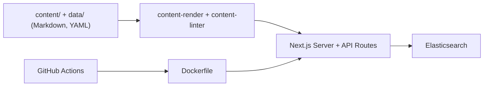

# github/docs

> Sources ouvertes de la documentation de GitHub, pour qui veut la corriger ou la compléter.

## Le problème
La documentation d'un produit change sans cesse ; il faut un canal où l'extérieur puisse proposer des corrections.

## Ce que ça fait vraiment
Le dépôt public accepte des contributions aux fichiers Markdown de `/content` et à quelques sections de `/data` (réutilisables). Il est synchronisé avec `github/docs-internal`, privé, réservé aux employés. Infrastructure, workflows et code du site sont fermés aux contributions extérieures. D'après l'architecture décrite, le site est une application Next.js avec des API (article, REST, GraphQL, recherche), servie derrière un CDN.

## Comment c'est branché

## Essayer
Aucune commande documentée dans le README ; il renvoie aux guides de contribution.

## Coût et pièges
Gratuit. Licence CC-BY-4.0. Seuls les fichiers de contenu sont ouverts : inutile de proposer une correction du code du site.

## Ce que ce n'est pas
Pas un outil ni une bibliothèque : c'est un contenu. Le README ne décrit pas comment lancer le site en local.

## Alternatives
Aucune alternative citée dans le README (`github/docs-internal` est le pendant privé, pas un remplaçant).

## Pour toi
Ignorer : ne sert qu'à contribuer à la documentation de GitHub, sans usage direct pour un pipeline data ou IA.

