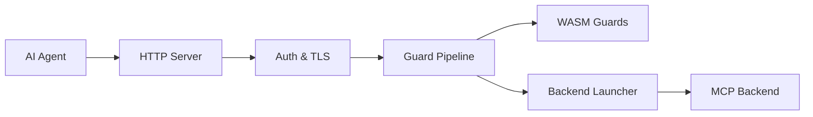

# github/gh-aw-mcpg

> Passerelle pour serveurs MCP avec politiques de garde, destinée aux agents des GitHub Agentic Workflows en bac à sable.

## Le problème
Un agent IA qui appelle des serveurs MCP peut lire ou écrire des données qu'il ne devrait pas : il faut un point de contrôle.

## Ce que ça fait vraiment
Un binaire Go (`awmg`) reçoit du JSON-RPC 2.0 et route vers des serveurs MCP lancés en conteneurs Docker (ou Podman), en mode routé (`/mcp/{serverID}`) ou unifié (`/mcp`). Des gardes WASM appliquent des règles d'intégrité et de secret (allow-only, write-sink) avant et après l'appel. Un mode proxy filtre aussi les requêtes REST/GraphQL de `gh`. Traçage OpenTelemetry, journaux JSONL et points de santé inclus.

## Comment c'est branché


## Essayer
```bash
docker pull ghcr.io/github/gh-aw-mcpg:latest
docker run --rm -i \
  -e MCP_GATEWAY_PORT=8000 \
  -e MCP_GATEWAY_DOMAIN=localhost \
  -e MCP_GATEWAY_AGENT_ID=your-agent-id \
  -v /var/run/docker.sock:/var/run/docker.sock \
  -v /path/to/logs:/tmp/gh-aw/mcp-logs \
  -p 8000:8000 \
  ghcr.io/github/gh-aw-mcpg:latest < config.json
```

## Coût et pièges
Le socket Docker est monté dans le conteneur, ce qui est sensible. Jeton GitHub nécessaire pour les serveurs GitHub. `/reflect` est sans authentification : ne l'expose que sur réseau de confiance.

## Ce que ce n'est pas
Pas un outil généraliste de sécurité : les gardes sont centrées sur GitHub. Le README signale que l'image est à tirer « quand disponible ».

## Alternatives
Aucune alternative nommée dans le README.

## Pour toi
Surveiller : pertinent si tu déploies des agents avec des serveurs MCP et veux filtrer leurs accès, mais très lié à l'écosystème GitHub Actions.
