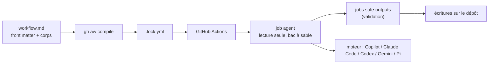

# github/gh-aw

> Définit des automatisations de dépôt pilotées par agent, en Markdown compilé vers GitHub Actions.

## Le problème
Le tri d'issues, la revue de PR ou l'enquête sur un échec de CI demandent de l'interprétation, que
des scripts déterministes ne savent pas faire ; brancher un agent sur un dépôt sans garde-fous est
un risque d'écriture incontrôlée.

## Ce que ça fait vraiment
Un workflow agentique a deux parties : un front matter YAML (déclencheurs, permissions, outils,
moteur IA) et un corps Markdown qui dit à l'agent quoi accomplir. `gh aw compile` valide cette source
et produit le `.lock.yml` que GitHub Actions exécute. Les moteurs intégrés sont GitHub Copilot,
Claude Code, OpenAI Codex, Google Gemini et Pi. Le job de l'agent est en lecture seule et en bac à
sable par défaut ; les écritures configurées passent par des jobs `safe-outputs` séparés qui les
tamponnent, les valident et les appliquent avec des permissions restreintes.

## Comment c'est branché


## Essayer
```bash
gh extension install github/gh-aw
go test ./pkg/linters//...
go build ./cmd/linters
make golint-custom
```

## Coût et pièges
Le moteur IA choisi consomme des jetons facturés à ton compte. Une faille de sécurité a été trouvée
dans les versions `>= 0.83.3, < 0.85.4`, retirées par précaution : épingler une version récente.

## Ce que ce n'est pas
Pas un remplaçant de CI/CD : le README insiste sur le fait que ça complète les Actions classiques,
qui restent la bonne réponse pour builds, tests, lint et déploiements. Pas sûr par défaut malgré les
garde-fous : le texte dit noir sur blanc que l'auteur doit relire permissions, outils, accès réseau
et fichiers générés, que la supervision humaine reste nécessaire et que ça peut mal tourner quand même.

## Alternatives
- GitHub Actions conventionnelles : pour tout ce qui est déterministe et reproductible.

## Pour toi
Le modèle « agent en lecture seule + safe-outputs » vaut d'être copié, même hors de GitHub.
