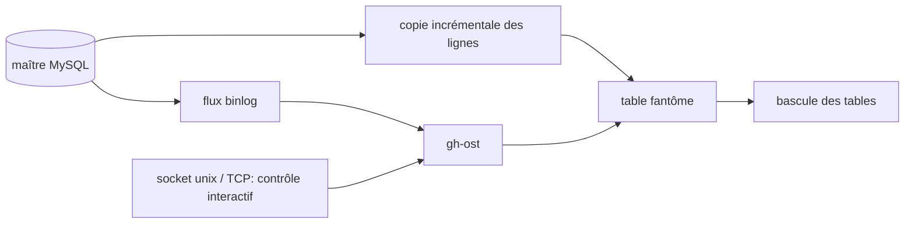

# github/gh-ost

> Migration de schéma MySQL en ligne, sans triggers, contrôlable et interruptible pendant l'exécution.

## Le problème
Les outils de changement de schéma en ligne s'appuient sur des triggers, dont découlent des
limitations et des risques sur le maître en charge.

## Ce que ça fait vraiment
Comme ses concurrents, gh-ost crée une table fantôme, y copie les données par incréments et propage
les écritures en cours, puis bascule les tables. La différence : il lit le flux de binlog au lieu
d'utiliser des triggers, et applique les événements de façon asynchrone. Il en tire un throttling
réel (arrêt complet des écritures sur le maître), une reconfiguration interactive en cours de
migration, un audit par socket unix ou TCP, et la possibilité de repousser la bascule
(`--postpone-cut-over-flag-file`) jusqu'à une heure qui t'arrange. Des hooks externes permettent de
l'intégrer à ton environnement.

## Comment c'est branché


## Essayer
```bash
script/build
./bin/gh-ost
build.sh
```
Les modes d'invocation (noop, `--execute`, `--test-on-replica`, `--exact-rowcount`,
`--postpone-cut-over-flag-file`) sont décrits dans le cheatsheet référencé par le README.

## Coût et pièges
Gratuit. Il faut un accès au binlog ; le mode réplique est requis si le maître est en réplication
par instructions (SBR). Construit avec Go 1.15 et au-delà. Le README insiste : commencer par
`--test-on-replica`, puis un noop, puis `--execute` ; `master` est généralement stable mais seules
les releases sont destinées à la production.

## Ce que ce n'est pas
Ce n'est pas pour PostgreSQL : c'est spécifiquement MySQL. Ce n'est pas instantané non plus — la
copie reste incrémentale, gh-ost ne change que la façon de capter les écritures concurrentes.
Des pages dédiées couvrent AWS RDS et Azure Database for MySQL, donc l'usage managé n'est pas
transparent.

## Alternatives
Le README cite `pt-online-schema-change` et l'online schema change de Facebook, dont gh-ost tire son
nom d'origine (`gh-osc`) — tous deux fonctionnent par triggers.

## Pour toi
Hors périmètre quotidien, sauf si un entrepôt applicatif MySQL alimente tes pipelines et qu'une
migration de schéma bloque la collecte.
