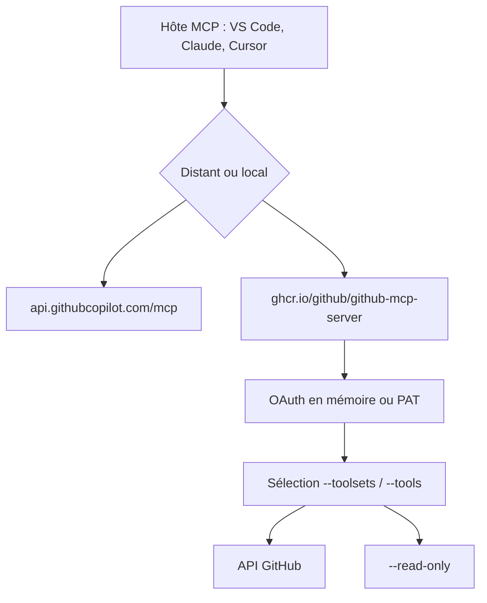

# github/github-mcp-server

> Serveur MCP officiel qui donne à un agent l'accès aux dépôts, issues, PR et Actions GitHub.

## Le problème
Un agent qui doit lire un dépôt, trier une issue ou analyser un échec de CI doit réinventer un client GitHub à chaque fois.
Chaque hôte MCP a sa syntaxe de configuration, ses scopes et sa gestion de jeton.

## Ce que ça fait vraiment
Connecte les outils IA à GitHub : parcours de code, recherche de fichiers, analyse de commits, création et mise à jour d'issues et de PR, suivi des runs Actions, alertes de sécurité et Dependabot, discussions et notifications.
Deux modes : serveur distant hébergé par GitHub (`https://api.githubcopilot.com/mcp/`, OAuth ou PAT) ou serveur local en image Docker `ghcr.io/github/github-mcp-server`, avec login OAuth en mémoire ou `GITHUB_PERSONAL_ACCESS_TOKEN`.
La surface d'outils se règle finement : `--toolsets` (repos, issues, pull_requests, actions, code_security, governance, projects…), `--tools` pour des outils individuels, `all` et `default` comme jeux spéciaux, `--read-only` prioritaire sur tout.
Supporte GitHub Enterprise Cloud avec résidence des données (`ghe.com`) et GitHub Enterprise Server via `--gh-host` ou `GITHUB_HOST`, HTTPS imposé.

## Comment c'est branché


## Essayer
```bash
claude mcp add github -e GITHUB_PERSONAL_ACCESS_TOKEN=$GITHUB_PAT -- docker run -i --rm -e GITHUB_PERSONAL_ACCESS_TOKEN ghcr.io/github/github-mcp-server
```

```bash
docker run -i --rm -e GITHUB_PERSONAL_ACCESS_TOKEN=<your-token> -e GITHUB_TOOLSETS="repos,issues,pull_requests,actions,code_security" ghcr.io/github/github-mcp-server
```

## Coût et pièges
Gratuit ; le coût est le périmètre du jeton. Le README recommande des scopes minimaux (`repo`, `read:packages`, `read:org`), des PAT distincts par projet et une rotation régulière.
GitHub Enterprise Server ne supporte pas le serveur distant ; il faut le local. Le support des variables d'environnement varie selon l'hôte, certains exigeant le jeton en dur dans un fichier de configuration.

## Ce que ce n'est pas
Ce n'est pas une sandbox : les outils d'écriture agissent réellement sur vos dépôts tant que `--read-only` n'est pas posé.
Ce n'est pas uniforme entre hôtes : la syntaxe, le processus et la stabilité de l'intégration varient, le README le dit.
Le mode insiders expose des outils expérimentaux : pas pour un usage stable ; le README fourni est tronqué au milieu de la liste des outils.

## Alternatives
Aucune alternative n'est nommée dans le README.

## Pour toi
À brancher avec `--read-only` et un jeu de toolsets restreint : le gain d'un agent qui lit vraiment tes PR est immédiat.
