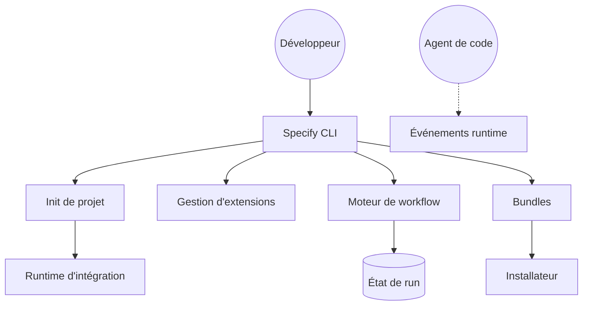

# github/spec-kit

> CLI qui installe dans un projet des processus balisés pour agents de code, signé GitHub.

## Le problème
Un agent lancé sur « ajoute cette fonctionnalité » saute la spécification et improvise.
Rien ne trace ce qui a été décidé, ni ce qui a été vérifié.

## Ce que ça fait vraiment
Trois processus indépendants : développement piloté par la spec, correction de bug, évaluation d'idée.
Le premier enchaîne constitution → specify → plan → tasks → implement → converge, en skills d'agent.
Le second sépare diagnostic, correction et vérification, et rend un verdict `verified`/`partial`/`failed`.
Le troisième produit une décision `go` / `needs-clarification` / `kill` dans `.specify/assessments/`.

## Comment c'est branché


## Essayer
```bash
uv tool install specify-cli
specify init my-project --integration copilot
specify extension add bug
specify extension add assess
```

## Coût et pièges
Gratuit. Python 3.11+ et `uv` requis, plus un agent de code supporté (exemples en Copilot).
Les `/speckit-*` sont des skills à invoquer dans le chat de l'agent, pas des commandes de terminal.

## Ce que ce n'est pas
Pas une garantie de qualité : les artefacts sont produits par le même modèle qui code.
Pas un gestionnaire de projet — rien ne relie les specs à un backlog ou à une CI.
Les trois processus ne forment pas une méthode unique : ce sont des points d'entrée séparés.

## Alternatives
- `addyosmani/agent-skills` : même intention, catalogue plus large et moins prescriptif.
- `affaan-m/ECC` : boucle plan/test/review comparable, avec beaucoup plus de surface.

## Pour toi
La discipline de spec avant code vaut pour tout projet data ; l'outil est encore jeune. À suivre.
