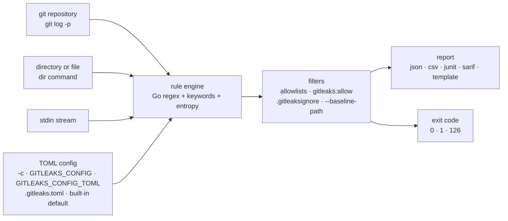

# gitleaks/gitleaks

> **A command-line secret scanner for git history, directories and standard input.**

## The problem

An API key committed by mistake stays in the git history even after it is removed from the
file: the visible fix does not delete the patch that contains it. Without tooling, finding
those secrets means reading thousands of diffs by hand, and nothing stops the next commit from
doing it again.

## What it actually does

Gitleaks detects secrets — passwords, API keys, tokens — in git repos, files and anything else
fed to it through `stdin`. Three scanning modes only: `git`, which under the hood uses
`git log -p` and scans patches (so only additions in the history), `dir` for a directory or a
file, and `stdin` for a stream.

The engine is built on Go regular expressions (no lookahead support), with keyword pre-filtering
and a Shannon entropy check on the captured group. Rules are declared in TOML: you start from
the default config built into the binary, extend it (`[extend]`, `useDefault = true`, chaining
up to a depth of 2) and switch off rules through `disabledRules`. Allowlists (`[[allowlists]]`
globally or per rule, with `commits`, `paths`, `regexes`, `stopwords` criteria and `OR`/`AND`
conditions) cut false positives; since v8.25.0 a shared allowlist can target several rules via
`targetRules`.

Three exclusion mechanisms coexist: a `#gitleaks:allow` comment on the line, a `.gitleaksignore`
file at the repo root keyed by finding fingerprint (a feature the README calls experimental),
and a baseline — any gitleaks report passed as `--baseline-path` so only new findings show up.

Two digging options, both off by default (value `0`): `--max-decode-depth` recursively decodes
percent, hex (≥ 32 characters) and base64 (≥ 16 characters) encoded text; `--max-archive-depth`
extracts and scans archive contents, with inner paths separated by `!`. Reports come out as
`json`, `csv`, `junit`, `sarif`, or in a custom shape through a Go `text/template` file
(`--report-template`). The composite rules added in v8.28.0 (`[[rules.required]]`, with
`withinLines` / `withinColumns` proximity constraints) are described in the README as
experimental and subject to change.

## How it is wired



No code-derived diagram exists for this repository: the graph above is reconstructed from the
README alone. The point worth keeping is the configuration precedence, spelled out explicitly:
`--config/-c`, then `GITLEAKS_CONFIG`, then `GITLEAKS_CONFIG_TOML`, then
`(target path)/.gitleaks.toml`, and failing all four the config built into the binary.

## Trying it

```bash
# MacOS
brew install gitleaks

# Docker (DockerHub)
docker pull zricethezav/gitleaks:latest
docker run -v ${path_to_host_folder_to_scan}:/path zricethezav/gitleaks:latest [COMMAND] [OPTIONS] [SOURCE_PATH]

# Docker (ghcr.io)
docker pull ghcr.io/gitleaks/gitleaks:latest
docker run -v ${path_to_host_folder_to_scan}:/path ghcr.io/gitleaks/gitleaks:latest [COMMAND] [OPTIONS] [SOURCE_PATH]

# From Source (make sure `go` is installed)
git clone https://github.com/gitleaks/gitleaks.git
cd gitleaks
make build
```

The three scanning modes, as written in the README:

```bash
gitleaks git -v --log-opts="--all commitA..commitB" path_to_repo
gitleaks dir -v path_to_directory_or_file
cat some_file | gitleaks -v stdin
```

The baseline, to keep only new findings:

```bash
gitleaks git --report-path gitleaks-report.json # This will save the report in a file called gitleaks-report.json
gitleaks git --baseline-path gitleaks-report.json --report-path findings.json
```

As a pre-commit hook, the README gives a `.pre-commit-config.yaml` pointing at
`https://github.com/gitleaks/gitleaks` with `rev: v8.24.2`, hook `id: gitleaks`, then
`pre-commit autoupdate` and `pre-commit install`. To skip the hook once:

```bash
SKIP=gitleaks git commit -m "skip gitleaks check"
```

## Cost and pitfalls

- **The repository is declared finished.** The README opens with a warning: gitleaks is feature
  complete, no new features will be merged, future releases will be security patches only, and
  the author is moving his focus to
  [betterleaks/betterleaks](https://github.com/betterleaks/betterleaks). That fact outweighs
  every other: the tool works, it will not grow.
- **One author at the wheel**, writing in the first person throughout the README and announcing
  his own move to another project. Hence the alert kept on this card.
- **Nothing to run as a service**: a Go binary, Docker images, a Homebrew formula, a releases
  page. No API key, no account, no SaaS, no cost announced.
- **The two most useful options are off by default**: `--max-decode-depth` and
  `--max-archive-depth` both default to `0`, meaning no decoding and no archive traversal. A
  base64-encoded secret, or one inside a tarball, goes unnoticed until you turn them on.
- **The `git` mode only looks at additions** in the history — the README notes this when
  discussing composite rules, which it says may therefore not be very useful for git scans.
- **Deprecated commands**: `detect` and `protect` have been hidden from `--help` since v8.19.0;
  they still work but should be translated to `git` / `dir`.
- **Three features flagged unstable**: `.gitleaksignore` (experimental, subject to change),
  composite rules (experimental), and two TOML renames to know about — `[rules.allowlist]` →
  `[[rules.allowlists]]` in v8.21.0 (backwards-compatible) and `[allowlist]` → `[[allowlists]]`
  in v8.25.0.
- **Exit code 1 by default** whenever a leak is found: in CI, one false positive breaks the
  build until you set `--exit-code` or add an allowlist.

## What it is not

- **It is not remediation.** Gitleaks *detects* — the README puts the word in bold. It does not
  rewrite history, does not revoke the keys it finds, does not notify anyone. The work starts
  when the report comes out.
- **It is not a smart classifier**: it is regex plus an entropy threshold, which the author owns
  by linking to a post titled "Regex is (almost) all you need". False positives are handled by
  hand, through allowlists, stopwords and ignored fingerprints — which is why the config format
  is so full of them.
- **It is not a product that will get better**: see the warning at the top of the README. Anyone
  expecting new detectors will have to write them in TOML, or follow the successor project.
- **It is not a turnkey CI action**: the GitHub Actions integration lives in a separate
  repository, `gitleaks/gitleaks-action`.
- **It is not a dependency scanner or a SAST tool**: it looks for strings that look like
  secrets, and nothing else.

## Alternatives

| | When to pick it instead |
|---|---|
| **betterleaks/betterleaks** | Named in the README's opening paragraph as the successor: that is where the author's effort now goes. Look at it first if you are starting today and want a project still under development. The README says nothing about its maturity or config compatibility. |
| **gitleaks/gitleaks-action** | Named in the README: the same engine wrapped as a GitHub action. Pick it when the target is a GitHub workflow rather than a workstation or a local hook. |

The catalogue neighbours (`j3ssie/osmedeus`, `edoardottt/cariddi`, `fengshao1227/ccg-workflow`,
`nucleuscloud/neosync`) are not comparable: offensive reconnaissance frameworks, a web crawler
and a test-data anonymisation tool, none of which detects secrets in git history.

## For you

Worth adopting as a guardrail on the workstation and in CI: a dependency-free binary, dropped in
as a pre-commit hook, costing a few seconds and heading off the OpenAI key or service token
committed inside a notebook — the most ordinary failure mode of data work. The baseline
(`--baseline-path`) is what makes adoption bearable on an old repository that is already
polluted. The caveat: the project will only receive security patches from now on, so plan to
watch the successor, and count the false-positive triage time as the real cost of the tool, not
the installation.
