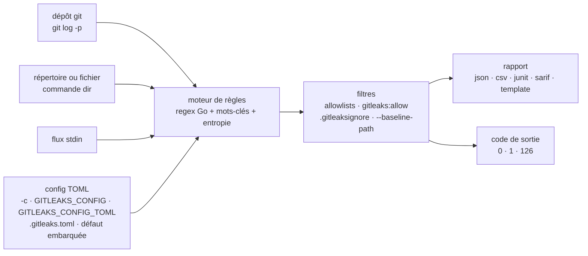

# gitleaks/gitleaks

> **Scanner de secrets en ligne de commande pour historiques git, répertoires et flux d'entrée standard.**

## Le problème

Une clé d'API commitée par erreur reste dans l'historique git même après avoir été retirée du
fichier : le correctif visible ne supprime pas le patch qui la contient. Sans outil, repérer ces
secrets suppose de relire à la main des milliers de diffs, et rien n'empêche le prochain commit
de recommencer.

## Ce que ça fait vraiment

Gitleaks détecte des secrets — mots de passe, clés d'API, jetons — dans des dépôts git, des
fichiers et tout ce qu'on lui envoie par `stdin`. Trois modes de scan seulement : `git`, qui
s'appuie sous le capot sur `git log -p` et scanne les patches (donc uniquement les ajouts de
l'historique), `dir` pour un répertoire ou un fichier, `stdin` pour un flux.

Le moteur est à base d'expressions régulières Go (pas de lookahead), avec pré-filtrage par
mots-clés et contrôle d'entropie de Shannon sur le groupe capturé. Les règles se déclarent en
TOML : on part de la config par défaut embarquée dans le binaire, on l'étend (`[extend]`,
`useDefault = true`, chaînage jusqu'à une profondeur de 2) et on désactive au besoin certaines
règles par `disabledRules`. Des listes d'autorisation (`[[allowlists]]` globales ou par règle,
critères `commits`, `paths`, `regexes`, `stopwords`, conditions `OR`/`AND`) limitent les faux
positifs ; depuis la v8.25.0 une allowlist commune peut viser plusieurs règles via `targetRules`.

Trois mécanismes d'exclusion coexistent : le commentaire `#gitleaks:allow` sur la ligne, le
fichier `.gitleaksignore` à la racine (par empreinte de finding, fonction annoncée comme
expérimentale) et un fichier de référence — n'importe quel rapport gitleaks passé en
`--baseline-path` pour ne voir que les nouveautés.

Deux options de creusement, désactivées par défaut (valeur `0`) : `--max-decode-depth` décode
récursivement les textes encodés en percent, hex (≥ 32 caractères) et base64 (≥ 16 caractères) ;
`--max-archive-depth` extrait et scanne le contenu des archives, avec chemins internes séparés
par `!`. Les rapports sortent en `json`, `csv`, `junit`, `sarif`, ou dans un format maison via un
gabarit Go `text/template` (`--report-template`). Les règles composites de la v8.28.0
(`[[rules.required]]`, contraintes `withinLines` / `withinColumns`) sont annoncées par le README
comme expérimentales et susceptibles de changer.

## Comment c'est branché



Aucun diagramme tiré du code n'existe pour ce dépôt : ce schéma est reconstruit depuis le seul
README. Le point à retenir est l'ordre de précédence de la configuration, énoncé en toutes
lettres : `--config/-c`, puis `GITLEAKS_CONFIG`, puis `GITLEAKS_CONFIG_TOML`, puis
`(chemin cible)/.gitleaks.toml`, et à défaut la config par défaut du binaire.

## Essayer

```bash
# MacOS
brew install gitleaks

# Docker (DockerHub)
docker pull zricethezav/gitleaks:latest
docker run -v ${path_to_host_folder_to_scan}:/path zricethezav/gitleaks:latest [COMMAND] [OPTIONS] [SOURCE_PATH]

# Docker (ghcr.io)
docker pull ghcr.io/gitleaks/gitleaks:latest
docker run -v ${path_to_host_folder_to_scan}:/path ghcr.io/gitleaks/gitleaks:latest [COMMAND] [OPTIONS] [SOURCE_PATH]

# From Source (make sure `go` is installed)
git clone https://github.com/gitleaks/gitleaks.git
cd gitleaks
make build
```

Les trois modes de scan, tels qu'écrits dans le README :

```bash
gitleaks git -v --log-opts="--all commitA..commitB" path_to_repo
gitleaks dir -v path_to_directory_or_file
cat some_file | gitleaks -v stdin
```

Le fichier de référence, pour ne garder que les nouveaux findings :

```bash
gitleaks git --report-path gitleaks-report.json # This will save the report in a file called gitleaks-report.json
gitleaks git --baseline-path gitleaks-report.json --report-path findings.json
```

En crochet pre-commit, le README donne un `.pre-commit-config.yaml` pointant
`https://github.com/gitleaks/gitleaks` en `rev: v8.24.2`, hook `id: gitleaks`, puis
`pre-commit autoupdate` et `pre-commit install`. Pour sauter le crochet ponctuellement :

```bash
SKIP=gitleaks git commit -m "skip gitleaks check"
```

## Coût et pièges

- **Le dépôt est déclaré terminé.** Le README ouvre sur un avertissement : gitleaks est
  « feature complete », aucune nouvelle fonctionnalité ne sera fusionnée, les prochaines
  versions ne seront que des correctifs de sécurité, et l'auteur déplace son effort vers
  [betterleaks/betterleaks](https://github.com/betterleaks/betterleaks). C'est le fait qui
  domine tous les autres : l'outil marche, il n'évoluera plus.
- **Un seul auteur au volant**, qui écrit à la première personne dans le README et annonce
  lui-même son départ vers un autre projet. D'où l'alerte retenue.
- **Rien à installer côté service** : binaire Go, images Docker, formule Homebrew, page de
  releases. Pas de clé d'API, pas de compte, pas de SaaS, aucun coût annoncé.
- **Les deux options les plus utiles sont éteintes par défaut** : `--max-decode-depth` et
  `--max-archive-depth` valent `0`, c'est-à-dire pas de décodage et pas de traversée d'archives.
  Un secret en base64 ou dans un tarball passe donc inaperçu tant qu'on ne les active pas.
- **Le mode `git` ne voit que les ajouts** de l'historique — le README le note à propos des
  règles composites, qui en deviennent « pas super utiles » pour ce mode.
- **Commandes dépréciées** : `detect` et `protect` sont cachées du `--help` depuis la v8.19.0,
  toujours présentes mais à traduire vers `git` / `dir`.
- **Trois fonctions marquées instables** : `.gitleaksignore` (expérimental, sujet à changement),
  les règles composites (expérimental), et deux renommages de syntaxe TOML à connaître —
  `[rules.allowlist]` → `[[rules.allowlists]]` en v8.21.0 (rétrocompatible) et `[allowlist]` →
  `[[allowlists]]` en v8.25.0.
- **Code de sortie 1 par défaut** dès qu'un leak est trouvé : en CI, un faux positif casse le
  build tant qu'on n'a pas réglé `--exit-code` ou une allowlist.

## Ce que ce n'est pas

- **Ce n'est pas une remédiation.** Gitleaks *détecte* — le README insiste sur le mot en gras.
  Il ne réécrit pas l'historique, ne révoque pas les clés trouvées, ne prévient personne. Le
  travail commence quand le rapport sort.
- **Ce n'est pas un classifieur intelligent** : c'est de la regex plus un seuil d'entropie, ce
  que l'auteur assume en renvoyant à un billet intitulé « Regex is (almost) all you need ». Les
  faux positifs se gèrent à la main, par allowlists, stopwords et empreintes ignorées — d'où
  l'abondance de ces mécanismes dans la configuration.
- **Ce n'est pas un produit qui va s'améliorer** : voir l'avertissement en tête de README. Qui
  attend de nouveaux détecteurs devra les écrire lui-même en TOML, ou suivre le projet
  successeur.
- **Ce n'est pas une action CI clé en main** : l'intégration GitHub Actions est un dépôt
  séparé, `gitleaks/gitleaks-action`.
- **Ce n'est pas un scanner de dépendances ni un SAST** : il cherche des chaînes qui ressemblent
  à des secrets, rien d'autre.

## Alternatives

| | Quand le préférer |
|---|---|
| **betterleaks/betterleaks** | Désigné dans le premier paragraphe du README comme la suite : c'est là que va l'effort de l'auteur. À regarder d'abord si l'on démarre aujourd'hui et qu'on veut un projet encore en développement. Le README ne dit rien de sa maturité ni de sa compatibilité de configuration. |
| **gitleaks/gitleaks-action** | Nommé dans le README : le même moteur emballé en action GitHub. À préférer quand la cible est un workflow GitHub plutôt qu'un poste de travail ou un crochet local. |

Les voisins proposés par le catalogue (`j3ssie/osmedeus`, `edoardottt/cariddi`,
`fengshao1227/ccg-workflow`, `nucleuscloud/neosync`) ne sont pas comparables : ce sont des
cadres de reconnaissance offensive, un crawler web et un outil d'anonymisation de données de
test, aucun ne fait de la détection de secrets dans l'historique git.

## Pour toi

À adopter comme garde-fou de poste de travail et d'intégration continue : un binaire sans
dépendance, posé en crochet pre-commit, qui coûte quelques secondes et évite la clé OpenAI ou
le jeton de service commités dans un notebook — le mode d'échec le plus banal d'un travail data.
Le fichier de référence (`--baseline-path`) est ce qui rend l'adoption supportable sur un dépôt
ancien déjà pollué. À nuancer : le projet ne recevra plus que des correctifs de sécurité, donc
prévoir de surveiller le successeur, et compter le temps de tri des faux positifs comme le vrai
coût de l'outil, pas l'installation.
