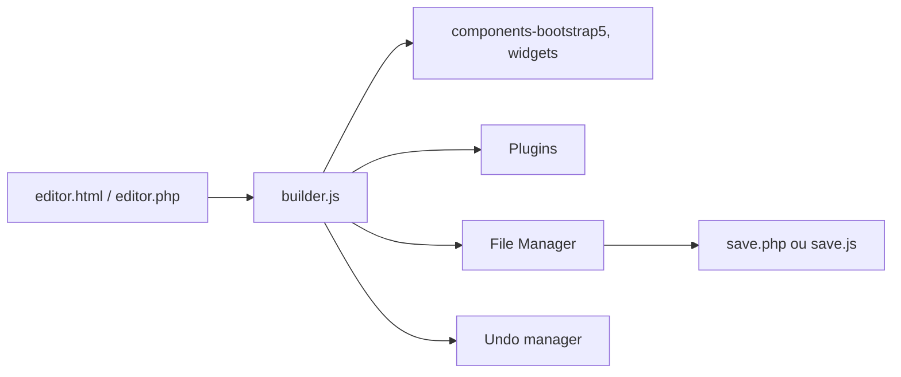

# givanz/VvvebJs

> Bibliothèque JavaScript de constructeur de pages par glisser-déposer, écrite en JS pur avec Bootstrap 5.

## Le problème
Offrir à des non-développeurs un éditeur visuel de pages web sans intégrer un framework lourd.

## Ce que ça fait vraiment
Éditeur avec composants et blocs, annuler/rétablir, gestionnaire de fichiers, éditeur de code CodeMirror, galerie de médias, polices Google, widgets (YouTube, Google Maps, Charts.js) et export ou sauvegarde de page. Il est étendable par plugins (CKEditor, JSZip, un assistant IA). La sauvegarde et l'envoi d'images exigent un petit backend PHP (`save.php`) ou Node (`save.js`).

## Comment c'est branché


## Essayer
```bash
git clone --recurse-submodules https://github.com/givanz/VvvebJs
docker run -p 8080:80 vvveb/vvvebjs
npm install express
node save.js
```
Puis ouvrir http://localhost:8080/editor.html.

## Coût et pièges
Gratuit. Il faut un serveur web (l'iframe interdit le mode `file://`) et PHP ou Node pour sauvegarder. Le README montre un lancement de Chrome avec `--disable-web-security` : réservé à un profil jetable.

## Ce que ce n'est pas
Ce n'est pas un CMS : le README renvoie à Vvveb CMS pour cela. La documentation détaillée se trouve dans le wiki.

## Alternatives
Vvveb CMS est nommé pour un usage CMS complet ; un wrapper React est signalé.

## Pour toi
Ignorer : constructeur de pages web hors périmètre data/IA/MLOps.

