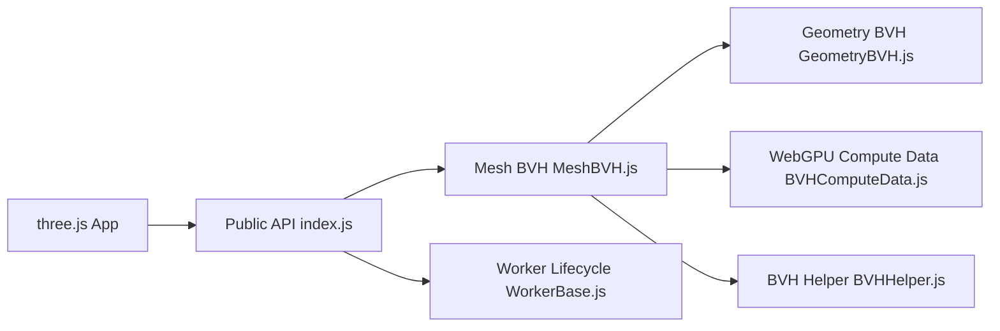

# gkjohnson/three-mesh-bvh

> Hiérarchie de volumes englobants pour accélérer le raycasting et les requêtes spatiales sur maillages three.js.

## Le problème
Le raycasting natif de three.js teste chaque triangle : trop lent sur de gros modèles.

## Ce que ça fait vraiment
Construit un BVH sur une géométrie et remplace `Mesh.raycast`. Fournit aussi des BVH pour points, lignes, maillages skinnés et hiérarchies d'objets, des requêtes directes (shapecast, sphère), la sérialisation, la génération en worker (parallèle avec SharedArrayBuffer) et des requêtes en shader WebGL/WebGPU. Le README cite 500 rayons sur 80 000 polygones à 60 fps.

## Comment c'est branché


## Essayer
```bash
npm start
```
Puis ouvrir `localhost:5173/<nom>.html` pour un exemple du dossier `example`. Le code d'usage figure en JavaScript dans le README.

## Coût et pièges
Le BVH n'est pas dynamique : pas de morph targets ni de skinning (hors `SkinnedMeshBVH`) ; il faut régénérer ou `refit` si la géométrie change. Centrer les grosses géométries pour la précision flottante.

## Ce que ce n'est pas
Pas un moteur 3D ni de physique complet. Certaines fonctions (worker, sérialisation) ne sont pas supportées pour les BVH points/lignes.

## Alternatives
Aucune alternative nommée dans le README (three-gpu-pathtracer, three-bvh-csg listés comme projets externes qui l'utilisent).

## Pour toi
À ignorer pour un profil data/IA, sauf projet de visualisation 3D web : excellent dans son domaine mais sans lien avec tes besoins.

