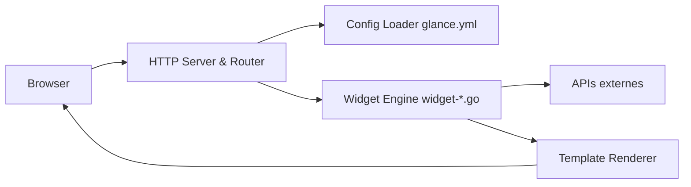

# glanceapp/glance

> Tableau de bord auto-hébergé agrégeant flux RSS, Reddit, météo et marchés, configuré en YAML.

## Le problème
Suivre ses sources (flux, dépôts, vidéos, état des conteneurs) oblige à ouvrir dix onglets.

## Ce que ça fait vraiment
Binaire Go unique (<20 Mo) qui lit `glance.yml`, récupère les données de chaque widget au chargement de la page, les met en cache, et rend du HTML via templates Go avec assets embarqués. Widgets RSS, Hacker News, Reddit, YouTube, Twitch, marchés, releases GitHub, Docker, stats serveur, plus widgets personnalisés (`custom-api`, `html`, `iframe`).

## Comment c'est branché


## Essayer
```bash
mkdir glance && cd glance && curl -sL https://github.com/glanceapp/docker-compose-template/archive/refs/heads/main.tar.gz | tar -xzf - --strip-components 2
docker compose up -d
go build -o build/glance .
```

## Coût et pièges
Gratuit. Pas de rafraîchissement en arrière-plan : il faut recharger la page. Les DNS bloqueurs de pub (Pi-Hole) peuvent provoquer des timeouts.

## Ce que ce n'est pas
Pas un outil de monitoring ni d'alerte ; pas de données temps réel.

## Alternatives
Aucune nommée dans le README.

## Pour toi
Pratique pour un tableau de veille perso (releases, flux) ; hors outillage MLOps.
