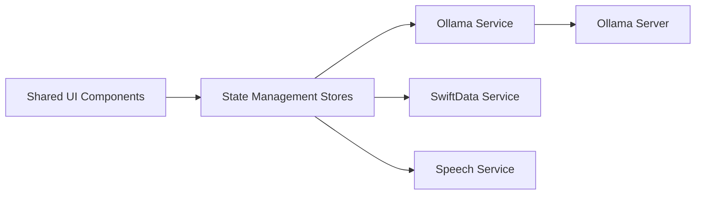

# gluonfield/enchanted

> Client iOS, macOS et visionOS de type ChatGPT pour modèles auto-hébergés via Ollama.

## Le problème
Parler à ses modèles Ollama depuis un iPhone ou un Mac demande une interface native qui n'existe pas par défaut.

## Ce que ça fait vraiment
App SwiftUI connectée à un serveur Ollama (v0.1.14+) : historique local (SwiftData), Markdown, pièces jointes images.
Prompts vocaux et lecture à voix haute, prompt système, modèles de prompts personnalisés.
Panneau Spotlight sur macOS (Ctrl+⌘+K).

## Comment c'est branché


## Essayer
```bash
ngrok http 11434 --host-header="localhost:11434"
```
Puis installer l'app depuis l'App Store et saisir l'URL du serveur.

## Coût et pièges
App gratuite ; il faut un serveur Ollama joignable, souvent exposé via ngrok, ce qui ouvre ton serveur à Internet.

## Ce que ce n'est pas
Pas un serveur de modèles. Le README annonce que le projet a une nouvelle itération, Jaz.

## Alternatives
- Jaz : nouvelle itération du projet selon le README.

## Pour toi
À ignorer : simple client grand public ; pour un usage pro d'Ollama, l'API directe ou une UI web suffisent.
