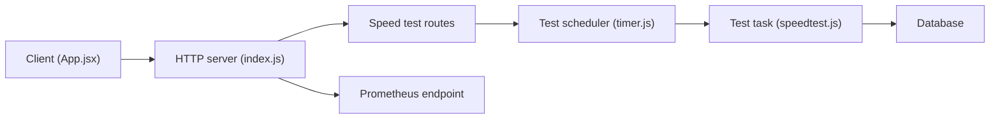

# gnmyt/MySpeed

> Application qui mesure et historise la vitesse de ta connexion internet, avec statistiques et alertes.

## Le problème
Un test de débit ponctuel ne montre ni la tendance ni les coupures d'un fournisseur d'accès.

## Ce que ça fait vraiment
Elle lance des tests planifiés par expression cron avec Ookla, LibreSpeed ou Cloudflare, et garde les résultats pour la durée choisie. Elle affiche débit, ping et statistiques. Elle envoie des alertes par e-mail, Signal, WhatsApp ou Telegram, et expose un endpoint Prometheus pour Grafana. Plusieurs nœuds sont gérables.

## Comment c'est branché

## Essayer
Le README ne donne pas de commande : il renvoie à des guides d'installation pour Linux et Windows.

## Coût et pièges
Gratuit. Les tests consomment de la bande passante à chaque exécution, et les serveurs de test sont des services tiers. Environ 89 issues ouvertes.

## Ce que ce n'est pas
Pas un outil de supervision réseau complet. Les liens entre certaines fonctions (notifications, nœuds) et le code n'ont pas été vérifiés.

## Alternatives
Aucune alternative nommée dans le README.

## Pour toi
À surveiller si tu veux suivre la qualité de ton lien : le lien Prometheus/Grafana s'intègre bien à un homelab MLOps.

