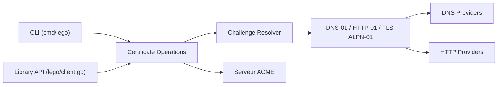

# go-acme/lego

> Client et bibliothèque Go pour obtenir et renouveler des certificats TLS auprès de Let's Encrypt et d'autres autorités ACME.

## Le problème
Les certificats TLS expirent et leur renouvellement à la main finit par être oublié. Prouver qu'on contrôle un domaine (HTTP, DNS, TLS-ALPN) est fastidieux dès que le DNS est chez un hébergeur particulier.

## Ce que ça fait vraiment
Implémente ACME v2 (RFC 8555) : enregistrement auprès de l'autorité, obtention, renouvellement et révocation de certificats, avec ou sans CSR existante. Gère les défis http-01, dns-01 et tls-alpn-01, et embarque plus de 200 fournisseurs DNS (Cloudflare, Route 53, OVH, Gandi…). Sert en ligne de commande ou comme bibliothèque Go. Prend aussi en charge les certificats pour adresses IP et l'extension ARI.

## Comment c'est branché

## Essayer
Le README ne documente pas de commande : les sections Installation et Usage renvoient au site de documentation (https://go-acme.github.io/lego/). Aucune commande n'est donc reprise ici.

## Coût et pièges
Gratuit. Il faut un identifiant d'API chez son fournisseur DNS pour le défi dns-01, et un domaine réellement contrôlé. Les quotas de l'autorité ACME s'appliquent.

## Ce que ce n'est pas
Ce n'est pas un serveur web ni un gestionnaire de déploiement : il produit des certificats, c'est à toi de les installer et de planifier le renouvellement. Le README ne détaille ni installation ni usage.

## Alternatives
Aucune alternative nommée dans le README.

## Pour toi
À adopter si tu automatises des certificats pour des services internes ou des pipelines MLOps : binaire unique, licence MIT, très large support DNS, et projet actif (dernier push septembre 2026).

