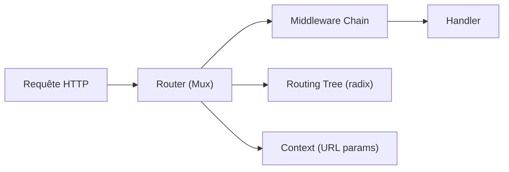

# go-chi/chi

> Routeur HTTP léger et composable pour Go, compatible net/http, pensé pour de grandes API REST.

## Le problème
Le multiplexeur standard de Go gère mal les sous-routeurs, les paramètres d'URL et l'enchaînement de middlewares dans une grosse API.

## Ce que ça fait vraiment
Routeur d'environ 1000 lignes, basé sur un arbre radix de Patricia, avec `Use`, `With`, `Group`, `Route`, `Mount`, paramètres nommés et expressions régulières. Fournit un paquet de middlewares standards (Logger, Recoverer, Timeout, RequestID, Compress, Throttle…) et quatre middlewares `ClientIPFrom*` pour l'IP client ; `RealIP` est marqué déprécié (usurpation possible). Sans dépendance externe.

## Comment c'est branché


## Essayer
```sh
go get -u github.com/go-chi/chi/v5
```

## Coût et pièges
Gratuit. Choisir un seul middleware `ClientIPFrom*` selon l'infrastructure ; ne pas utiliser `RealIP`. Les chiffres de benchmark du README datent de 2020.

## Ce que ce n'est pas
Ce n'est pas un framework complet : pas d'ORM ni de validation. Il ne couvre que le routage et les middlewares.

## Alternatives
Aucune alternative nommée dans le README (webrpc, gRPC, GraphQL cités pour aller au-delà de REST).

## Pour toi
Surveiller : bon choix si tu exposes un modèle derrière une API Go ; sans intérêt en Python.

