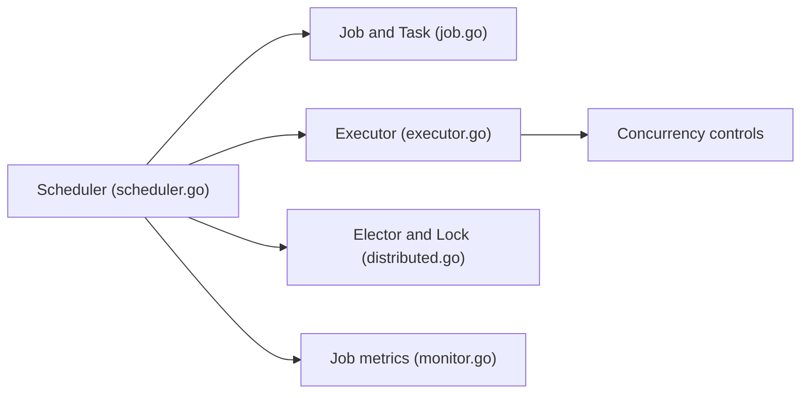

# go-co-op/gocron

> Bibliothèque de planification de tâches Go : exécuter des fonctions à intervalles ou heures fixes.

## Le problème
Lancer périodiquement des fonctions Go avec contrôle de la concurrence, sans dépendre d'un cron système.

## Ce que ça fait vraiment
Planificateur et exécuteur : jobs par durée, durée aléatoire, cron, quotidien, hebdomadaire, mensuel ou ponctuel. Mode singleton, limite globale de concurrence, calcul de l'intervalle depuis la fin du job. Élection de leader et verrous pour instances multiples, écouteurs d'événements, journalisation, métriques (aucune implémentation open source fournie), horloge simulée pour les tests.

## Comment c'est branché


## Essayer
```bash
go get github.com/go-co-op/gocron/v2
```
```go
s, _ := gocron.NewScheduler()
s.NewJob(gocron.DurationJob(10*time.Second), gocron.NewTask(func() {}))
s.Start()
```

## Coût et pièges
Gratuit. Planification dans le processus : si le service s'arrête, les jobs aussi. Verrous et élection à brancher soi-même (implémentations go-co-op).

## Ce que ce n'est pas
Pas un orchestrateur de workflows (Airflow, etc.) ni un service autonome.

## Alternatives
Aucune nommée dans le README ; gocron-ui pour une interface web.

## Pour toi
À surveiller : utile pour des tâches périodiques légères en Go ; pour des pipelines de données, un orchestrateur dédié reste préférable.

