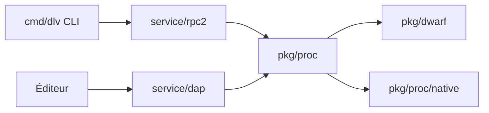

# go-delve/delve

> Débogueur pour le langage Go, destiné aux développeurs Go.

## Le problème
Déboguer du Go avec des `Println` ou avec gdb, mal adapté aux goroutines et aux types Go.

## Ce que ça fait vraiment
README minimal : une liste de liens et deux phrases (débogueur simple et complet pour Go). D'après l'architecture décrite d'après le code : un client CLI `cmd/dlv` parle à un service (rpc2 / JSON-RPC ou DAP pour les éditeurs) au-dessus d'un moteur (`pkg/proc`, `pkg/dwarf`, `pkg/gobuild`), avec des adaptateurs par OS (`pkg/proc/native`) et un REPL Starlark.

## Comment c'est branché

## Essayer
Aucune commande documentée dans le README fourni ; voir le site du projet.

## Coût et pièges
Gratuit. Le tracker GitHub est réservé aux bugs (propositions par liste de diffusion). Le README mentionne une politique d'usage de l'IA.

## Ce que ce n'est pas
Ce n'est pas un outil multi-langages : il ne débogue que du Go. Le README fourni n'expose ni installation ni usage.

## Alternatives
Aucune alternative nommée dans le README.

## Pour toi
Surveiller : matière du README insuffisante pour juger l'usage ; utile seulement si tu écris du Go (services, outillage MLOps), sans intérêt direct pour la data en Python.

