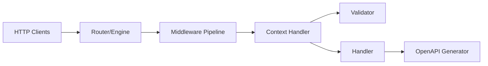

# go-fuego/fuego

> Framework Go qui génère la documentation OpenAPI depuis les types du code, pour développeurs d'API.

## Le problème
Les frameworks Go classiques ne déduisent pas les schémas OpenAPI des signatures ; la doc se maintient à part.

## Ce que ça fait vraiment
Routage fondé sur `net/http` (Go 1.22), génériques pour typer entrée et sortie, (dé)sérialisation JSON/XML/formulaires, validation via go-playground/validator, transformations `InTransform`/`OutTransform`, erreurs RFC 9457, rendu `html/template`, templ ou gomponents. Adaptateurs pour Gin et Echo. Le README parle de « production-ready » ; je n'ai pas de preuve dans le texte.

## Comment c'est branché


## Essayer
```go
s := fuego.NewServer()
fuego.Get(s, "/", func(c fuego.ContextNoBody) (string, error) { return "Hello, World!", nil })
s.Run()
```
```bash
curl http://localhost:8088/std
```

## Coût et pièges
Gratuit ; chaîne Go requise. Les exemples du README supposent `fuego.NewServer()` et un port à configurer.

## Ce que ce n'est pas
Pas un ORM ni un framework front. Ce n'est pas un outil d'inférence de modèles.

## Alternatives
Chi, Gin, Fiber et Echo, cités comme frameworks établis mais sans déduction OpenAPI depuis les signatures.

## Pour toi
À ignorer, sauf si tu exposes des modèles derrière une API Go : hors du cœur data/IA, et sans besoin spécifique ici.

