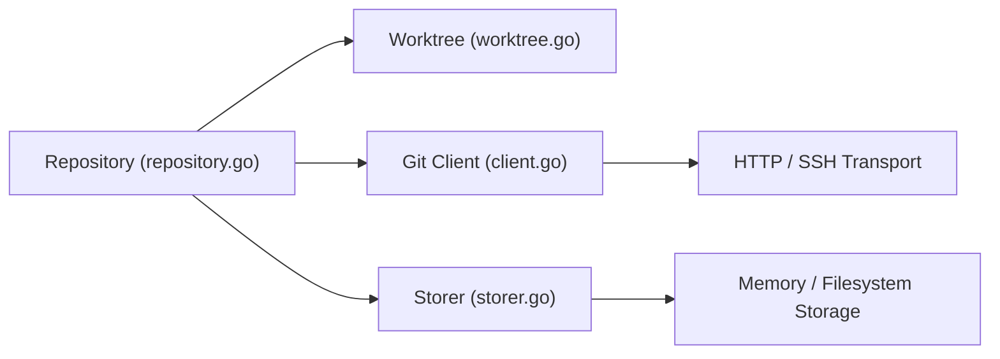

# go-git/go-git

> Implémentation de Git en Go pur, pour manipuler des dépôts dans des programmes Go.

## Le problème
Utiliser Git depuis Go sans dépendre du binaire `git` installé.

## Ce que ça fait vraiment
API haut niveau (clone, log, worktree) et bas niveau (objets, packfiles, index, références, protocole). Transports HTTP et SSH. Stockage système de fichiers, mémoire ou personnalisé via `Storer`. Utilisé par Keybase, Gitea, Pulumi, Prow, Flux (README). Parité avec git partielle, voir la page de compatibilité.

## Comment c'est branché


## Essayer
```go
import "github.com/go-git/go-git/v6"
_, err := git.PlainClone("/tmp/foo", &git.CloneOptions{URL: "https://github.com/go-git/go-git"})
```

## Coût et pièges
Gratuit. Fonctionnalités git manquantes possibles. Version v6 dans l'import.

## Ce que ce n'est pas
Pas un client Git complet remplaçant `git`.

## Alternatives
Aucune nommée (comparaison avec git lui-même).

## Pour toi
À surveiller : utile pour des outils Go qui lisent des dépôts (CI, GitOps) ; en Python, passe par GitPython ou le CLI.

