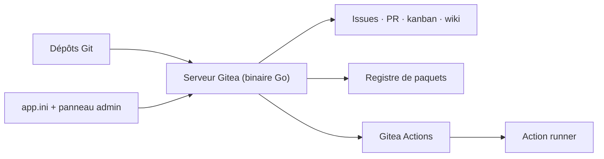

# go-gitea/gitea

> Forge Git auto-hébergée tout-en-un, écrite en Go.

## Le problème
Héberger son code sans dépendre d'un service externe demande d'assembler Git, revue de code, tickets, wiki, registre de paquets et CI séparément.

## Ce que ça fait vraiment
Un seul service qui couvre l'hébergement Git, la gestion et la revue de code, le suivi de tickets, le kanban de projet, le wiki, la collaboration d'équipe, le registre de paquets et la CI/CD — laquelle peut réutiliser des GitHub Actions. Écrit en Go, donc disponible sur Linux, macOS, FreeBSD/OpenBSD et Windows, en x86, amd64, ARM, RISC-V 64 et PowerPC. Un go-sdk officiel, une CLI `tea` et un runner d'actions complètent l'ensemble.

## Comment c'est branché


## Essayer
```bash
./gitea web
./gitea help
```

## Coût et pièges
Le logiciel est gratuit et auto-hébergeable, via conteneur (docker/podman) et l'image officielle. Des offres payantes existent : Gitea Cloud (essai gratuit) et gitea.com en service gratuit limité en nombre de dépôts. La configuration se partage entre le panneau admin (dynamique) et `app.ini`, qui impose un redémarrage.

## Ce que ce n'est pas
Ce n'est pas un clone exact de GitHub : la réutilisation des GitHub Actions est annoncée mais le runner est distinct. Les traductions passent par Crowdin, pas par des PR directes. Le README renvoie l'essentiel à la doc externe : ni prérequis de build, ni dimensionnement n'y figurent.

## Alternatives
- gitea/awesome-gitea : la liste des projets tiers, si tu cherches un SDK, un thème ou un plugin.

## Pour toi
À adopter pour héberger tes dépôts et ta CI en interne, notamment quand le code ne doit pas sortir du réseau.
